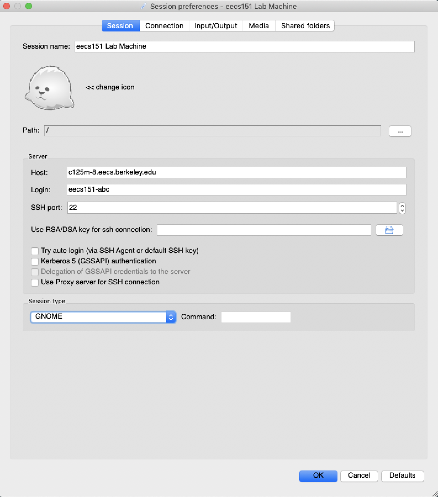

# EECS 151/251A ASIC Lab 1: Getting Around the Compute Environment
<p align="center">
Prof. Bora Nikolic
</p>
<p align="center">
TAs: Daniel Grubb, Nayiri Krzysztofowicz, Zhaokai Liu
</p>
<p align="center">
Department of Electrical Engineering and Computer Science
</p>
<p align="center">
College of Engineering, University of California, Berkeley
</p>

## Overview

The process of VLSI design is different than developing software, designing analog circuits, and even FPGA-based design. Instead of using a single graphical user interface (GUI) or environment (eg. Eclipse, Cadence Virtuoso, or Xilinx Vivado), VLSI design is done using dozens of command line interface tools on a Linux machine.  These tools primarily use text files as their inputs and outputs, and include GUIs mainly for only visualization, rather than design.  Therefore, familiarity with Linux, text manipulation, and scripting is required to successfully complete the labs this semester.

The goal of this lab is to introduce some basic techniques needed to use the computer aided design (CAD) tools that are taught in this class. Mastering the topics in this lab will help you save hours of time in later labs and make you a much more efficient chip designer. While you go through this lab, focus on how these techniques will allow you to automate tasks and improve your efficiency. Chip design requires plenty of iteration, so being able to perform trials and identify errors quickly is key to success.

## Administrative Info

This lab, like all labs will be turned in electronically using Gradescope. Please upload a pdf document with the answers to the six questions in the lab.

### Getting an Instructional Account

You are required to get an EECS instructional account to login to the workstations in the lab, since you will be doing all your work on these machines (whether you're working remotely or in-person). This can be done by using WebAcct here: http://inst.eecs.berkeley.edu/webacct.

Once you login using your CalNet ID, you can click on 'Get a new account' in the eecs151 row. Once the account has been created, you can email your class account form to yourself to have a record of your account information.  You can follow the instructions on the emailed form to change your Linux password with `ssh update.eecs.berkeley.edu` and following the prompts.

## Logging into the Classroom Servers

The servers used for this class are primarily `eda-[1-8].eecs.berkeley.edu`.  You may also use the `c111-[1-17].eecs.berkeley.edu` machines
(which are physically located in Cory 111/117), although those will be shared with the FPGA lab. You can access all of these machines remotely through SSH.

### Remote Access

It is important that you can remotely access the instructional servers. There are two convenient ways to remotely access our
lab machines: SSH (Secure SHell) and X2Go.
First, select a machine. The range of accessible machines are `eda-X`, where X is a number from 1 to 8,
and `c111-X`, where X is a number from 1 to 17. The fully qualified DNS name (FQDN) of
your machine is then `eda-X.eecs.berkeley.edu` or `c111-X.eecs.berkeley.edu`. For example,
if you select machine `eda-8`, the FQDN would be `eda-8.eecs.berkeley.edu`.
You can use any lab machine, but our lab machines aren’t very powerful; if everyone
uses the same one, everyone will find that their jobs perform poorly. ASIC design tools are resource
intensive and will not run well when there are too many simultaneous users on these machines. We
recommend that every time you want to log into a machine, examine its load on https://hivemind.eecs.berkeley.edu/ 
for the `eda-X` machines, or using `top` when you log in. If it is heavily loaded, consider
using a different machine. If you also notice other `eecs151` users with jobs consuming excessive
resources, do feel free to reach out to the GSIs about it.
Next, note your instructional class acccount name - the one that looks like `eecs151-YYY`, for example
`eecs151-abc`. This is the account you created at the start of this lab.


#### SSH: Linux, BSD, MacOS

SSH is the de facto remote terminal tool for Linux and BSD systems (which includes macOS). It
lets you login to a text console from anywhere (as long as you have network connectivity). SSH
also comes as a standard utility in almost all Linux and BSD systems.
If you’re using Linux or BSD, you should be able to access your workstation through SSH by running:

```shell
ssh eecs151-YYY@eda-X.eecs.berkeley.edu
```

In our examples, this would be:

```shell
ssh eecs151-abc@eda-8.eecs.berkeley.edu
```

The SSH protocol also enables file transfer between your local and lab machines via the `sftp` and
`scp` utilities. **WARNING: please only transfer files needed for your reports and nothing else, particularly files relating to CAD tool commnads or process technologies!!!**


#### SSH: Windows

The classic and most lightweight way to use SSH on Windows is PuTTY (https://www.putty.org/). Download it and login with the FQDN above as the Host and your instructional account
username. You can also use WinSCP (winscp.net) for file transfer over SSH.
Advanced users may wish to install Windows Subsystem for Linux (https://docs.microsoft.com/en-us/windows/wsl/install-win10, Windows 10 build 16215 or later) or Cygwin (cygwin.com) and use SSH, SFTP, and SCP through there.


#### SSHL Session Management

Because all your work will be done remotely, we recommend that you utilize SSH session management tools and that all terminal-based work be done over SSH. This would allow your remote terminal sessions to remain active even if your SSH session disconnects, intentionally or not.
The two most common session managers are tmux and screen. These run persistently on the
remote workstation, are highly customizable, and can greatly improve your productivity.
Here are some good tmux and screen tutorials:
* https://www.hamvocke.com/blog/a-quick-and-easy-guide-to-tmux/
* https://www.rackaid.com/blog/linux-screen-tutorial-and-how-to/


#### X2Go

For situations in which you need a graphical interface (waveform debugging, layout viewing, etc.),
you should use X2Go. This is a faster and more reliable alternative to more traditional XForwarding over SSH. X2Go is also recommended because it connects to a persistent graphical
desktop environment, which continues running even if your internet connection drops.
Download the X2Go client for your platform from the website: https://wiki.x2go.org/doku.php/download:start.

Note: MacOS sometimes blocks the X2Go download/install, if it does follow the directions here: https://support.apple.com/en-us/HT202491.

To use X2Go, you need to create a new session (look under the Session menu). Give the session any
name, it doesn’t matter, but set the Host field to the FQDN of your lab machine and the User field
to your instructional account username. For “Session type”, select “GNOME”. Here’s an example from macOS:

<p align="center">

</p>


### Getting Started

After you login to one of these servers, you are now ready to start the lab.  You have a limited amount of space in your home directory, so we recommend completing work in the `/scratch/` directory, and then copying any important results to your home directory.

To begin, get the lab files by typing the following commands:

```shell
mkdir /scratch/<your-eecs-username>
cd /scratch/<your-eecs-username>
git clone /home/ff/eecs151/labs/lab1
cd lab1
```


## Linux Basics

You will need to learn how to use Linux so that you can understand what programs are running
on the server, manipulate files, launch programs, and debug problems. Please read through the
tutorial here: http://linuxcommand.org/lc3_learning_the_shell.php

To use the CAD tools in this class, you will need to load the class environment. All of the tools
are already installed on the network filesystem, but by default users do not have the tools in their
path. Try locating a program that is already installed (vim) and another which is not (innovus)
by default:

```shell
which vim
which innovus
```

The vim program has been installed in: `/usr/bin/vim`. If you show the contents of `/usr/bin`,
you will notice that you can launch any of programs by typing their filename. This is because
/usr/bin is in the environment variable `$PATH`, which contains different directories to search in a
colon-separated list.

```shell
echo $PATH
```

To be able to access the CAD tools, you will need to append to their location to the `$PATH` variable:

```shell
source /home/ff/eecs151/tutorials/eecs151.bashrc
echo $PATH
which innovus
```


#### Question 1: Common terminal tasks

For 1-6 below, submit the command/keystrokes needed to generate the desired result.  For 1-4, try generating only the desired result (no extraneous info). 

1. List the 5 most recently modified items in `/usr/bin`
2. What directory is `git` installed in?
3. Show the hidden files in your lab directory (the one you cloned from `/home/ff/eecs151/labs/lab1`
4. What version of Vim is installed? Describe how you figured this out.
5. Copy the files in this lab to `/scratch` and then delete it.
6. Run `ping www.google.com`, suspend it, then kill the process. Then run it in the background, report its PID, then kill the process.
7. Run `top` and report the average CPU load, the highest CPU job, and the amount of memory used (just report the results for this question; you don't need to supply the command/how you got it).


There are a few miscellaneous commands to analyze disk usage on the servers.

```shell
du -ch --max-depth=1 .
df -H
```

Finally, your instructional accounts have disk usage quotas. Find out how much you are allocated
and how much you are using:

```shell
quota -s
```

By default, you should be using the Bash shell (these labs are designed for Bash, not Csh). The
Bash Guide (guide.bash.academy) is a great resource for users at all levels of Bash profiency.


## Using Text Editors

Much of the time you will spend designing chips will be writing scripts in a text editor.
Therefore becoming proficient at editing text is a vital skill. Unlike Java or C programming, there
is no integrated development environment (IDE) for writing these scripts. However, many of the
advantages of IDE’s can be obtained by using the proper editor. In this class, we will be using
either Vim or Emacs. Editors such as gedit or nano are not allowed.

If you have never used Vim, please follow the tutorial here: http://www.openvim.com/tutorial.html (If you would prefer to learn Emacs, you can read http://www.gnu.org/software/emacs/tour/ and run the Emacs built-in tutorial with Ctrl-h followed by t). Feel free to search for other
resources online to learn more.

#### Question 2: Common editor tasks

For each task below, describe the keys you need to press to accomplish the action in the file `force_regs.ucli`.

1. Delete 5 lines
2. Search for the text `clock`
3. Replace the text `dut` with `device_under_test`
4. Jump to the end of the file
5. Go to line 42
6. Reload the file (in case it was modified in another window)
7. Save and exit


## Regular Expressions

Regular expressions allow you to perform complex ’Search’ or ’Search and Replace’ operations.
Please work through the tutorial here: http://regexone.com

Regular expressions can be used from many different programs: Vim, Emacs, grep, sed, Python,
etc. From the command line, use grep to search, and sed to search and replace.

Unfortunately, deciding what characters needs to be escaped can be somewhat confusing. For
example, to find all instances of `dcdc_unit_cell_x`, where `x` is a single digit number, using grep:

```shell
grep "unit_cell_[0-9]\{1\}\." force_regs.ucli
```

And you can do the same search in Vim:

```vim
vim force_regs.ucli
/unit_cell_[0-9]\{1\}\.
```

Notice how you need to be careful what characters get escaped (the `[` is not escaped but `{` is). Now
imagine we want to add a leading 0 to all of the single digit numbers. The match string in sed
could be:

```shell
sed -e 's/\(unit_cell_\)\([0-9]\{1\}\.\)/\10\2/' force_regs.ucli
```

Both sed, vim, and grep use ”Basic Regular Expressions” by default. For regular expressions heavy
with special characters, sometimes it makes more sense to assume most characters except `a-zA-Z0-9`
have special meanings (and they get escaped with only to match them literally). This is called
”Extended Regular Expressions”, and `?+{}()` no longer need to be escaped. A great resource
for learning more is http://en.wikipedia.org/wiki/Regular_expression#POSIX_basic_and_extended. In Vim, you can do this with `\v`:

```shell
:%s/\v(unit_cell_)([0-9]{1}\.)/\10\2/
```

And in sed, you can use the -r flag:

```shell
sed -r -e 's/(unit_cell_)([0-9]{1}\.)/\10\2/' force_regs.ucli
```

And in grep, you can use the -E flag:

```shell
grep -E "unit_cell_[0-9]{1}\." force_regs.ucli
```

sed and grep can be used for many purposes beyond text search and replace. For example, to find
all files in the current directory with filenames that contain a specific text string:

```shell
find . | grep ".ucli"
```

Or to delete all lines in a file that contain a string:

```shell
sed -e '/reset/d' force_regs.ucli
```

#### Question 3: Fun with Regular Expressions

For each regular expression, provide an answer for both basic and extended mode (`sed` and `sed -r`).
You are allowed to use multiple commands to perform each task. Operate on the `force_regs.ucli` file.

1. Change all x's surrounding numbers to angle brackets. For example, `regx15xx79x` becomes `reg<15><79>`. Hint: remember to enable global subsitution.
2. Make every number in the file be exactly 3 digits with padded leading zeros (except the last 0 on each line). Eg. line 120/121 should read:

```
force -deposit rocketTestHarness.dut.Raven003Top_withoutPads.TileWrap.
... .io_tilelink_release_data.sync_w002r.rq002_wptr_regx000x.Q 0
force -deposit rocketTestHarness.dut.Raven003Top_withoutPads.TileWrap.
... .io_tilelink_release_data.fifomem.mem_regx015xx098x.Q 0
```


## File Permissions

A tutorial about file permissions can be found here: http://www.tutorialspoint.com/unix/unix-file-permission.htm

#### Question 4: Understanding File Permissions

For each task below, please provide the commands that result in the correct permissions being set. Operate on the `run_always.sh` script.

1. Change the script to be executable by you only
2. Add permissions for everyone in your group to be able to execute the same script
3. Make the script writable by you ane everyone in your group, but unreadable by others
4. Change the owner of the file to be `eecs151` (Note: you will not be able to execute this command, so just provide the command itself)


## Using Makfiles

Makefiles are a simple way to string together a bunch of different shell tasks in an intelligent
manner. This allows someone to automate tasks and save time when doing repetitive tasks
since make targets allow for only files that have changed to need to be updated. Please read
through the following tutorial here: http://www.cs.colby.edu/maxwell/courses/tutorials/maketutor/ (optional). Further documentation on make can be found here: http://www.gnu.org/software/make/manual/make.html.

Let’s look at a simple makefile to explain a few things about how they work - this is not meant to
be anything more than a very brief overview of what a makefile is and how it works. If you look at
the Makefile in the provided folder in your favorite text editor, you can see the following lines:

```shell
output_name = force_regs.random.ucli

$(output_name): force_regs.ucli
    awk 'BEGIN{srand();}{if ($$1 != "") { print $$1,$$2,$$3,int(rand()*2)}}' $< > $@

clean:
    rm -f $(output_name)
```

While this may look like a lot of random characters, let us walk through each part of it to see that
it really is not that complicated.

Makefiles are generally composed of rules, which tell Make how to execute a set of commands to
build a set of targets from a set of dependencies. A rule typicall has this structure:

```shell
targets: dependencies
    commands
```

**It is very important that indentation in Makefiles are tabs, not spaces.**
The two rules in the above Makefile have targets which are clean and output name. Here,
output name is the name of a variable within the Makefile, which means that it can be overwritten
from the command line. This can be done with the following command:

```shell
make output_name=foo.txt
```

This will result in the output being written to `foo.txt` intstead of `force_regs.random.ucli`.
Generally, a rule will run everytime that its dependencies have been updated more recently than
its own targets, so by editing/updating the `force_regs.ucli` file (including via the touch command), you can regenerate the output name target. This is different than a bash script, as you can see in `runalways.sh`, which will always generate `force_regs.random.ucli` regardless of whether
`force_regs.ucli` is updated or not.

Inside the output name target, the `awk` command has a bunch of $ characters. This is because
in normal `awk` the variable names are `$1`, `$2`, and then in the makefile you have to escape those
variable names to get them to work properly. In Make, the character to do that is `$`.

The other characters after the awk script are also special characters to make. The `$<` is the first
dependency of that target, the `>` simply redirects the output of awk, and the `$@` is the name of the
target itself. This allows users to create makefiles that can be reusable, since you are operating on
a dependency and outputting the result into the name of your own target.

#### Question 5: Makefile Targets

1. Add a new make rule that will create a file called `foo.txt`.  Make it also run the `output_name` rule.
2. Name at least two ways that you could have the makefile regenerate the `output_name` target after its rule has been run.


## Comparing Files

Comparing text files is another useful skill. The tools generally behave as black
boxes, so comparing output files to prior output files is an important debugging technique.

From the command lines, you can use `diff` to compare files:

```shell
diff force_regs.ucli force_regs.random.ucli
```

You can also compare the contents of directories (the `-q` flag will summarize the results to only
show the names of the files that differ, and the `-r` flag will recurse through subdirectories).
For Vim users, there is a useful built-in `diff` tool:

```shell
vimdiff force_regs.ucli force_regs.random.ucli
```


## Version Control with Git

Version control systems help track how files change overtime and make it easier for collaborators
to work on the same files and share their changes. We use git to distribute the lab files so that
bug fixes can easily be incorporated into your files. Please go through the following tutorial:
https://try.github.io

#### Question 6: Checking Git Understanding

Submit the command required to perform the following tasks:

1. What is the difference between your current Makefile and the file you started with?
2. How do you make a new branch?
3. What is the SHA of the version you checked out?

## Customization

Many of the commands and tools you will use on a daily basis can be customized. This can
dramatically improve your productivity. Some tools (e.g. vim and bash) are customized using “dotfiles,” which are hidden files in your home directory (e.g. `.bashrc` and `.vimrc`) that contain a series of commands which set variables, create aliases, or change settings. Try adding the following lines to your `.bashrc` and restart your session or source
`~/.bashrc`. Now when you change directories, you no longer need to type `ls` to show the directory contents.

```shell
function cd {
    builtin cd "$@" && ls -F
}
```

The following links are useful for learning how to make some common customizations. You should
read these but are not required to turn in anything for this section.
* https://www.digitalocean.com/community/tutorials/an-introduction-to-useful-bash-aliases-and-functions
* http://statico.github.io/vim.html


## Lab Deliverables

### Lab Due: 11 AM, Friday September 10th, 2021

- Submit a written report with all 6 questions answered to Gradescope

## Acknowledgement

This lab is the result of the work of many EECS151/251 GSIs over the years including:
Written By:
- Nathan Narevsky (2014, 2017)
- Brian Zimmer (2014)
Modified By:
- John Wright (2015,2016)
- Ali Moin (2018)
- Arya Reais-Parsi (2019)
- Cem Yalcin (2019)
- Tan Nguyen (2020)
- Harrison Liew (2020)
- Sean Huang (2021)
- Daniel Grubb, Nayiri Krzysztofowicz, Zhaokai Liu (2021)
