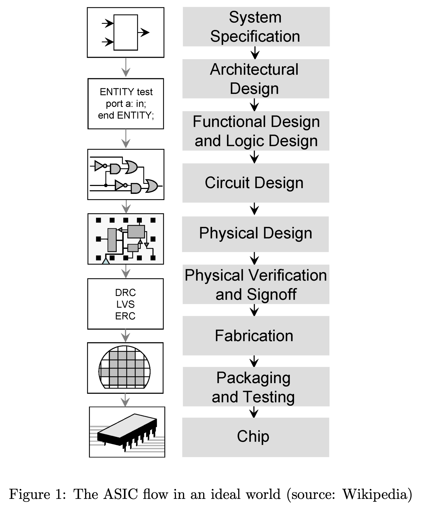
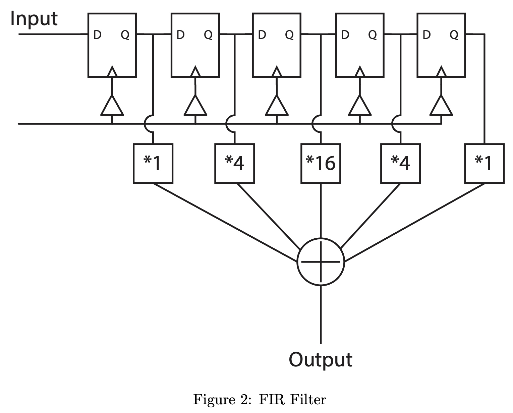
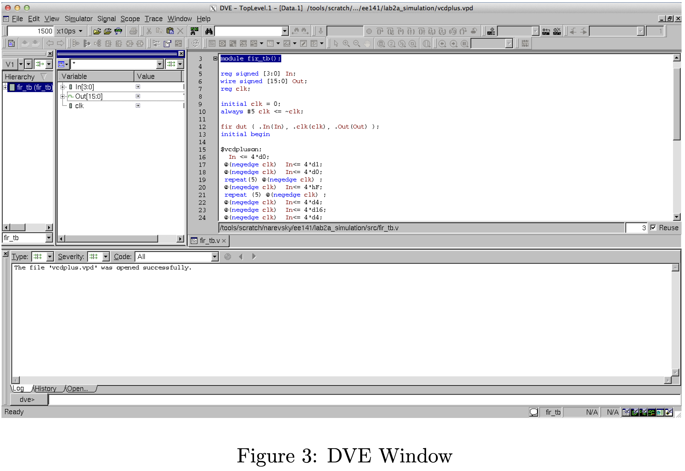
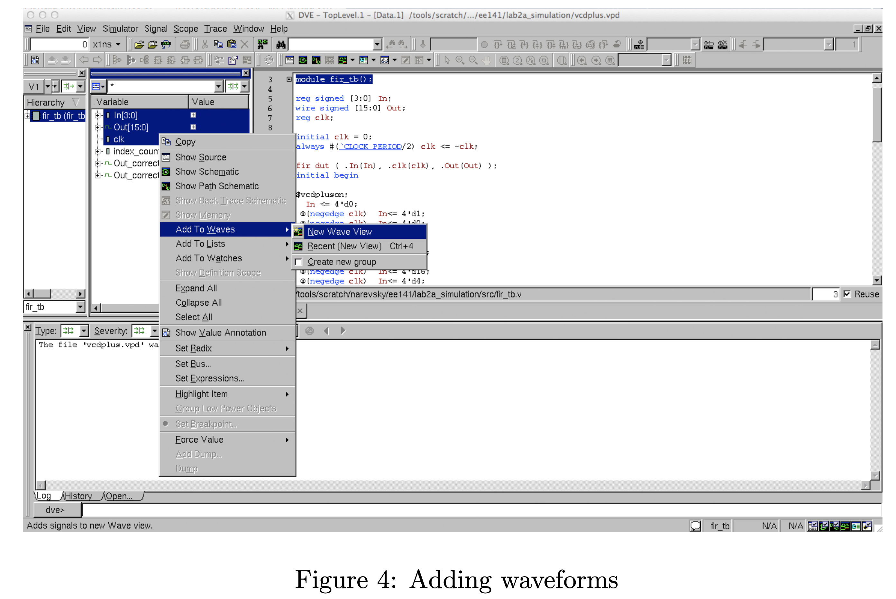
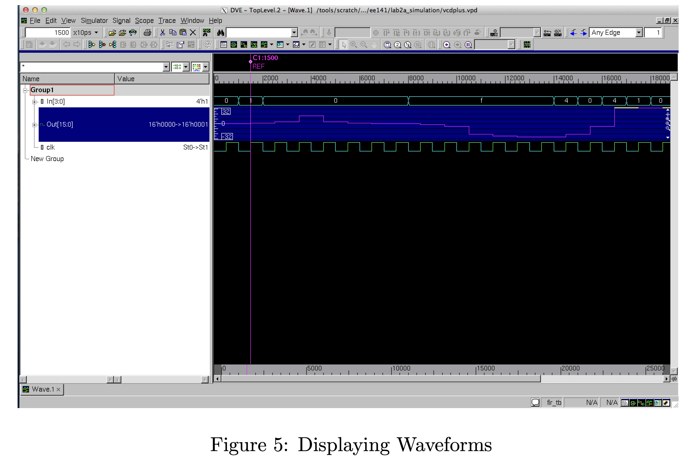
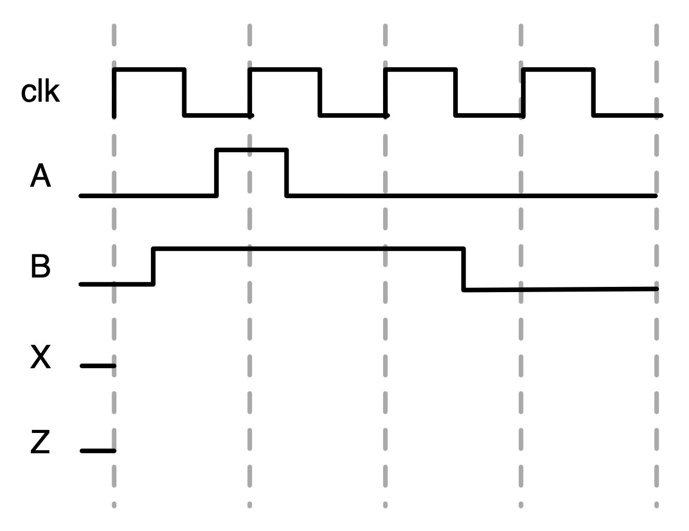
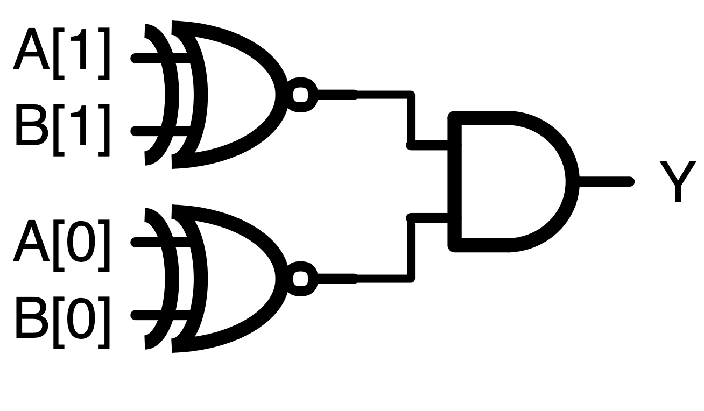
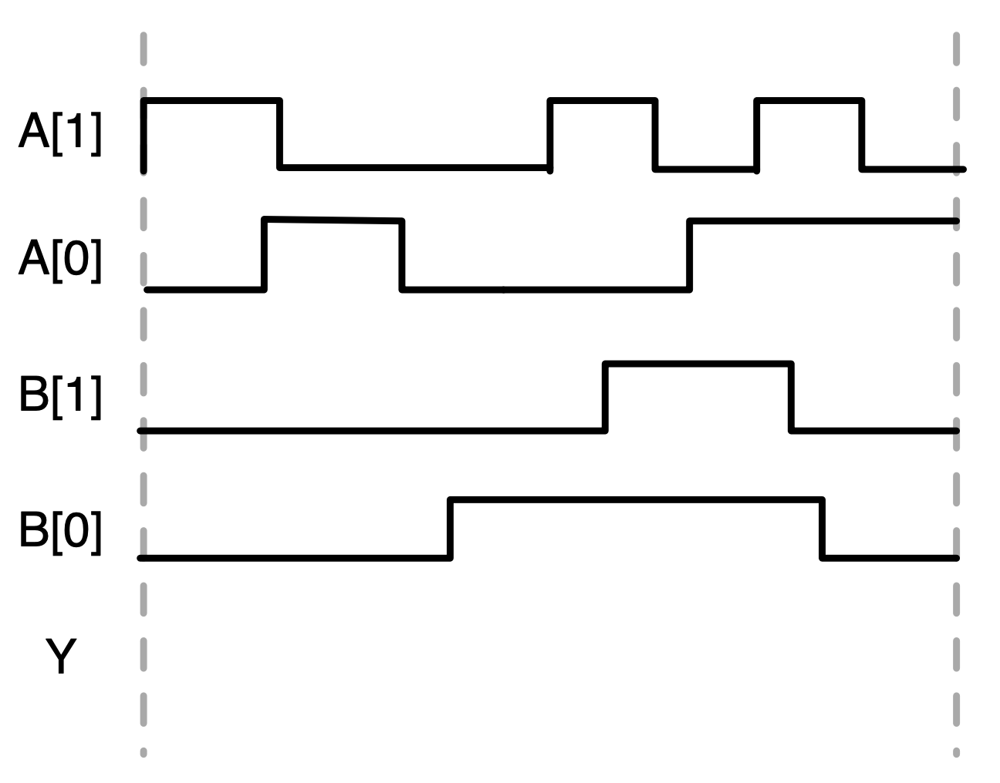
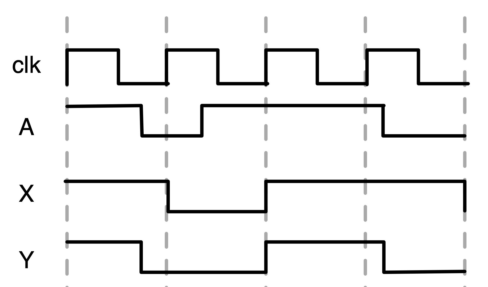

# EECS 151/251A ASIC Lab 2: Simulation
<p align="center">
Prof. Bora Nikolic
</p>
<p align="center">
TAs: Daniel Grubb, Nayiri Krzysztofowicz, Zhaokai Liu
</p>
<p align="center">
Department of Electrical Engineering and Computer Science
</p>
<p align="center">
College of Engineering, University of California, Berkeley
</p>


## Overview

In the course so far, you have learned the basics of using Verilog to describe hardware at the register-transfer-level
(RTL). It might be helpful to take some time to review the [Verilog Primer Slides](https://inst.eecs.berkeley.edu/~eecs151/fa21/files/verilog/Verilog_Primer_Slides.pdf) before doing this lab. There are several other Verilog references in the [Resources section](https://inst.eecs.berkeley.edu/~eecs151/fa21/#resources) of the course website that may be helpful.

In this lab, you will start working with Verilog and Verilog simulation.
Simulation is very important because it is used at multiple stages of the flow to help verify the functionality of a design. It can help a designer catch functional bugs, as well as physical timing issues.
We will focus on RTL, or Register Transfer Level, simulation in this lab, but we will also touch a bit on gate level simulation. 


As with the previous lab, we will be using the Cory instructional machines (again, preferably `eda-[1-8].eecs.berkeley.edu`, but also `c111-[1-17].eecs.berkeley.edu`).

To begin this lab, get the project files (again, we recommend working in the `/scratch/<your login name>/`:

```shell
cd /scratch/<your login name>/
git clone /home/ff/eecs151/labs/lab2
cd lab2
```

## The ASIC Design Flow

Here is a basic diagram of a VLSI design flow, in an ideal world where
everything works the first time around:

<p align="center">

</p>


At first, it seems like a very straightforward process from a system specification to a chip, right?
However, the big piece that is missing from this diagram is simulation, or more broadly, verification.
System specifications and architectural designs need to be verified by simulating their behavioral
models against the expected system behavior. Functional and logical implementations of the system
must also need to be simulated for functional correctness. Only after there is high confidence can
we even begin to move onto the circuit (logic synthesis: Lab 3) and physical design (floorplanning,
placement, and routing: Labs 4 and 5). We must continue to simulate the design in these stages
to ensure that it will meet system specifications. After the layout of the circuit
is complete, the circuit must also be verified to meet physical rules imposed by the underlying
transistor technology (Lab 6). Only when these processes are all complete can a chip be fabricated,
packaged, and tested post-silicon.

Problems found in verification have big implications on the design.
More severe issues require the design to be changed earlier in the design flow, causing delays in the design process.
Hence, there is essentially a feedback loop from the output of each block in Fig. 1 to any block
before it–a number of loops far too great to show in Fig. 1. The fewer loops you take in the design
flow, the less time you waste. Therefore, it is imperative that you are well-versed in the mechanics
 of simulating your designs before even getting around to designing anything!


### CAD Tool Aside

You will find that there are several major CAD companies: Cadence, Synopsys, and Mentor Graphics.
Each of these companies supplies tools for all parts of the VLSI flow.
For instance, Cadence's synthesis suite is called Genus and Synopsys' synthesis suite is called Design Compiler (DC). The instructional machines have licenses available for many of these tools.
Oftentimes, designers will mix and match different tools for different portions of the design flow.
This is possble because the tools typically can write out to common file formats that can be consumed by other vendors' tools, or they provide utilities such that files can be converted to different formats.
For example, a design may use Synopsys `vcs` for simulation, Cadence `Genus` and `Innovus` for synthesis and place-and-route, respectively, and Mentor `calibre` for DRC and LVS.
We will gain experience using some of these different tools in subsequent labs.

Something to look out for is the rise of open source CAD tools and open technologies. You may look at initiatives like [OpenROAD](https://theopenroadproject.org/) and technologies like [Skywater130](https://github.com/google/skywater-pdk)

## RTL Simulation

This lab focuses on RTL simulation. RTL simulation is one of the first steps towards checking the baseline functionality of your design.
Fixing bugs at the RTL design phase makes subsequent debugging much easier. The resources required and runtime is much lower than gate level simulation.
This means it should be used often as you are developing a design.
RTL simulation can be used to run unit tests to check a small block, as well as to simulate the behavior of a whole core running software, or beyond.

For this lab, we will be using Verilog code that implements a very simple FIR (Finite Impulse Response) filter. A schematic of the filter is shown below.

<p align="center">

</p>

There is an input signal and a clock input, and 5 delayed versions of the input are kept, multiplied
by different coefficients, and then summed together. The expression for this particular filter is:

`y[n] = 1 * x[n] + 4 * x[n − 1] + 16 * x[n − 2] + 4 * x[n − 3] + 1 * x[n − 4]`

The input in our example is a 4 bit signed 2’s compliment number, and the output is a larger
bitwidth signed number to ensure that there is no overflow. The focus of this lab is not 
the filter design itself, but it serves as a useful example of a digital circuit to implement and test with Verilog
code. As such, Verilog code for this FIR filter is provided in the src folder.


## Simulation Environment

We will be using Synopsys VCS as our Verilog simulator in this course.
VCS works by compiling Verilog modules and generating a simulator binary file. 
You can then execute that binary file to produce the desired outputs. 
VCS is one of many Verilog simulators. Others include Cadence Incisive (formerly NCSim) and the open source Verilator.
The framework, mechanisms, and capabilities are quite similar between simulators.

Each CAD tool, including simulators, are highly configurable and can take in tens or hundreds (or more) configuration options. 
Invoking CAD tools manually and listing options and flags is unsustainable.
Thus, whether you're a student pushing through a design or an engineer at a big company, everyone has some kind of automated design flow.
This can come in many forms, from a series of TCL files (Tool Control Language, which is the language of choice for ASIC CAD tools) that are pushed around by Makefiles, to more configurable and re-usable design frameworks. 

In this course we will use an ASIC design framework developed here at Berkeley called [Hammer](https://github.com/ucb-bar/hammer).
Hammer abstracts away tool- (Cadence, Synopsys, Mentor, etc.) and technology- (TSMC, Intel,
etc.) specific considerations away from ASIC design. The philosophy of Hammer aims to maximize reusability
of design intent between projects that may have differently underlying tool infrastructures and
target different process technologies. Documentation about Hammer philosophy and usage is at
[hammer-vlsi.readthedocs.io](http://docs.hammer-eda.org/en/latest/). 

For this lab, we will be ”implementing” our designs using the [ASAP7 7nm Predictive Process Design Kit](http://asap.asu.edu/asap/). 
We have set up a bare-bones Hammer flow that you will see is largely shared between this lab and subsequent ones. 
You will execute steps within this flow by using a common Makefile. This flow is distilled from an [ASAP7 Tutorial](https://chipyard.readthedocs.io/en/dev/VLSI/Tutorial.html)
contained in [Chipyard](https://github.com/ucb-bar/chipyard), an open-source RISC-V SoC Design Framework also developed here at Berkeley.
Chipyard documentation can be found [here](https://chipyard.readthedocs.io/en/latest/) if are interested in learning more.

Hammer consumes serialized configuration in YAML or JSON format, which are used as
intermediate representation (IR) languages between higher-level physical design generators and the
underlying scripts that the ASIC design flow tools require. In this lab repository, you will see
a set of YAML files (`inst-env.yaml`, `asap7.yml`, `design.yml`, and a few `sim-<type>.yml`) that
contain Hammer IR for our design implementation. Of these files, you will only interact with
the `sim-<type>.yml` files to configure your simulation flow in this lab. The sources for this lab are
contained in the src folder, and some special non-Verilog files will be explained later.

The Hammer Python core is installed at `/home/ff/eecs151/hammer`, along with plugins for
Cadence (Genus Synthesis, Innovus Place-and-Route, Voltus Power), Synopsys (VCS Simulator),
and Mentor Graphics (Calibre DRC/LVS) tools. **Note: The ASAP7 PDK and the Hammer
plugins are provided to us solely for educational use. They should NEVER be copied
outside of instructional machines under any circumstances, or else we risk losing access
in the future!!!**

To get started, examine the `Makefile` in the lab files. Skimming through, you can see that there are
rules for the basic VLSI flow steps explored in these labs: simulation, power analysis, synthesis,
place-and-route (PAR), design rule checking (DRC), layout vs. schematic (LVS), and translational
steps between them. The top section of the Makefile defines variables that point to the YAML and
JSON files needed by Hammer.

First, examine the `sim-rtl.yml` file:

```shell
# RTL Simulation Variables
sim.inputs:
  input_files:
    - "src/fir.v"
    - "src/EECS151.v"
    - "src/addertree.v"
    - "src/fir_tb.v"
  timescale: "1ns/10ps"
  options:
    - "-notice"
    - "-line"
    - "+lint=all,noVCDE"
    - "+v2k"
    - "-debug"
    - "-sverilog"
  top_module: "fir"
  tb_name: "fir_tb"
  defines:
    - "CLOCK_PERIOD=1.00"
~
```

This is a snippet of Hammer IR in the `sim` namespace. These keys are consumed by Hammer to configure the simulation.
Notice that the simulator needs some specifications, such as the files that contain
our Verilog source code and our testbench name, some timescale on which to simulate and a clock
period, and some options. These will be explained below.
Exploring the other YAML files in this lab will give you an idea of what else is needed to define
environment, tool, and technology constraints.

It's not critical that you understand right now how Hammer works, but as you work through the ASIC labs, it may be interesting for you to think about why it may be useful and other methods of creating an ASIC flow design framework.

## Under the Hood

Now, let’s decipher what happens under the hood when we run a simulation with Hammer. 
You can find the VCS user guides from the eecs151 class-account home directory for reference: `/home/ff/eecs151/labs/manuals/vcsmx_ug.pdf`, `/home/ff/eecs151/labs/manuals/ucli_ug.pdf`, and `/home/ff/eecs151/labs/manuals/dve_ug.pdf`.
To get started, let’s set up our environment. You will need to do this for every terminal in
which you use Hammer on the instructional machines:

```shell
source /home/ff/eecs151/tutorials/eecs151.bashrc
export HAMMER_HOME=/home/ff/eecs151/hammer
source $HAMMER_HOME/sourceme.sh
```

You may find it useful to add these commands to your `.bashrc` so you don't need to run them manually every time.

Now, let’s run a basic RTL simulation and look at the terminal output:

```shell
make sim-rtl
```

Here is a summary of what you should see when you scroll through the terminal output after it
finishes, from top to bottom:
1. The first line is the command that the Makefile constructed for you.
2. This is followed by Hammer debug output, such as the technology and CAD tool used.
3. The first time you run `sim-rtl`, Hammer will extract the PDK, compile memories (unused
in this lab), and make an auto-build file. You will not see this again unless you clean your
working directory.
4. When it is time to simulate, Hammer issues a subprocess call to the VCS executable. Notice that the arguments passed to VCS are the same as the list of sim options from our
`sim-rtl.yml` file. One important setting here is the `timescale` option, which sets the
timescale for the Verilog testbench. We will discuss what this actually means later on in
the lab.
5. VCS compiles your Verilog code. If your code has errors, they will be shown during this step.
6. This is followed by a wall of “Lint” messages. Linting catches Verilog mistakes that aren’t
actual syntax errors, but cause common bugs. We intentionally used the `+lint=all` option
to trigger these messages. In this case, assigning a number like “1” instead of `16’d1` gives
Verilog less information about how you want the bits interpreted, which could cause a design
bug that is hard to track down.
7. The compilation finishes and generates a binary executable. If you look at the `sim-rtl` phony
(target is not a file) rule in the Makefile, the `--obj_dir` flag to the Hammer executable is
the target working directory. sim is the action, so our simulation environment and results
are in the `build/sim-rundir` folder. In that folder, you will see the binary executable: the
simv file.
8. This binary file is then executed with a TCL script argument `build/sim-rundir/run.tcl`,
with the options `-ucli -do run.tcl`. This is enabled by the option `-P access.tab`.
9. At the end, the simulation should report the observed values with the expected and actual
values at each timestep, and they should match. You can even automate the checking of these
outputs in either the testbench itself or through parsing the output text directly, but that
will be explained in more detail later.


## Viewing Waveforms

After completing the simulation, VCS dumps the waveforms to a file: `build/sim-rundir/vcdplus.vpd`.
This file contains simulation history data, and is generated in the Verilog testbench (`src/fir_tb.v`)
with the `$vcdpluson` and `$vcdplusoff` system tasks. A system task in Verilog is a function that
is created by the compiler to make things easier for you, and usually begins with a `$` character. We
will not dig deeper into system tasks in this lab, but they are very powerful tools that are worth
investing the time in learning.

Let us look at the waveforms in a graphical viewer DVE (Discovery Visualization Environment).
(Note: this will require X11 forwarding, so if you ssh from a terminal be sure to use either the
-X or -Y flag. If you are using PuTTy, make sure to enable X11 forwarding and have the proper
X server software installed. An example of an X server for Windows is a program called VcXsrv,
although there are a ton of other options). A faster, smoother, cross-platform alternative would be
to use X2Go (recommended option, see Lab 1 for instructions).

```shell
cd build/sim-rundir
dve -vpd vcdplus.vpd &
```

When DVE pops up, you should see the window below:

<p align="center">

</p>

This window will contain the design hierarchy, the signals in that level, as well as a lot of other
buttons and options. One important feature is towards the top left of the window where it has
a textfield and next to that says “x10ps”. This represents the units of time that the signals are
plotted on. Change this to be in units of nanoseconds.
You can add waveforms to a new view by selecting a few of them (In, Out and clk) and the right
clicking and going to “Add To Waves” and then clicking either “New Wave View” or “Recent”.
Since there are no other wave views open these both accomplish the same thing. If you already had
a wave view open, then you can selectively add signals to one wave view or another. A screenshot
of adding these waveforms is shown below.

<p align="center">

</p>

After the window opens, you may need to adjust the zoom settings from “View — Zoom“ or the
corresponding buttons on the toolbar. The picture below displays the output of the FIR filter as
a step waveform. This can be achieved by setting the radix of the signal to be 2’s compliment
(right-click — Set Radix — Twos compliment) and then changing the Set Draw Style Scheme to
be Vector: Analog (right-click — Set Draw Style Scheme — Analog). You then need to change the
properties of the signal since the beginning of the waveform does not utilize the full scale. If you
right click and go to properties, you can set the Analog Waveform properties to be User, and set
the Min to be -32 and the max to be 32. Then you should see something similar to the waveform
below.

<p align="center">

</p>

For those of you who know a bit about FIR filters, this beginning section of the waveform is the
filter’s impulse response.

When looking at a waveform viewer like DVE, signals are generally shown in green. Blue lines (annotated as `Z`) are high impedance (unconnected) nets.
In our designs, this typically indicates that something is not wired up correctly. 

Red lines (annotated as `X`) indicate that a net has an unknown value at that time. You may see this at the beginning of the simulation before the registers in the filter have known values. Once they get a known value, the lines turn green.


## Testbenches

Testbenches are how you simulate a design. Specifically they setup the inputs and check the
outputs of the submodule that you are trying to test. If you look at the `fir_tb.v` file in the `src/`
folder, there are a few important parts that you will need to understand in order to write your own
testbench. The first important piece is generating the clock waveform. This is accomplished by the
following lines of Verilog code:

```verilog
reg clk;

initial clk = 0;
always #(`CLOCK_PERIOD/2) clk <= ~clk;
```

This creates a signal named `clk`, which is initially 0 and toggles every `CLOCK_PERIOD` divided
by 2 (in order to generate a rising edge every `CLOCK_PERIOD`). This clock period is defined in the
`sim.inputs.defines` key in the `sim-rtl.yml` file you saw above. After we have a clock waveform,
the next step is to setup the inputs. There is an initial begin block that is the body of the testbench
that does this work. Let us look at a piece of it:

```verilog
initial begin
$vcdpluson;
  In <= 4'd0;
  @(negedge clk) In<= 4'd1;
  @(negedge clk) In<= 4'd0;
  .
  .
  .
  @(negedge clk) In<= 4'd13;
  @(negedge clk) In<= 4'd14;
  @(negedge clk) In<= 4'd15;
  $vcdplusoff;
  $finish;
end
```

The `$vcdpluson` and `$vcdplusoff` are system tasks that setup the vpd file generation that we
used to look at the waveforms in the previous section. The other lines setup the register `In` to
take on different values after the negative edge of the clock. In this block, the lines are executed
after each other, so the next `@(negedge clk)` call waits until the next negative edge of the clock
before executing the code that follows it. This allows us to set up a series of values for the inputs
sequentially in time. The reason that we are operating on the negative edge of the clock is that the
registers that are sampling the inputs operate on the positive edge, so we want to make sure that
the correct value is sampled when that edge occurs. If we were to change the inputs on the same
edge, we could cause a hold time violation later when delay gets annotated.

The above code sets up the values sequentially, but you can do this in a much cleaner way by
reading values from a file. Take a look at the file `src/fir_tb_file.v`, parts of which are copied
below:

```verilog
initial begin
  $vcdpluson;
  repeat (26) @(negedge clk);
  $vcdplusoff;
$finish;

end

initial begin
    $readmemb("../../src/data_b.txt", Out_correct_array);
    $readmemb("../../src/input.txt", input_array);
end

assign Out_correct = Out_correct_array[index_counter];
assign In = input_array[index_counter];

always @(negedge clk) begin
    $display($time, ": Out should be %d, got %d", Out_correct, Out);
    index_counter <= index_counter + 1;
end
```

This testbench file uses text files to pull both the inputs and expected outputs, as well as displays
what the output is and what it thinks the correct output should be.

This is done using the `$readmemb` command, which reads a file into a verilog memory that you
instantiate in the testbench. By then using a counter to loop through both the input and the
desired output, the testbench simply needs to run for the right number of cycles, which is shown
using the `repeat` syntax inside the first initial begin block. Finally, this testbench uses `$display`,
which is verilog’s print statement to print out information about the waveforms to the console so
that you do not need to look at the waveforms. More sophisticated testbenches can be created
this way so that you do not have to look at the waveforms to gather the necessary information,
allowing you to automate your testing procedures. While this is a small enough design that you
could in theory debug using only the waveforms, the project later in this course will be much
more complicated so learning how to build automated testbenches will be very important. You can
run this automated testbench yourself by replacing `fir_tb` in `sim-rtl.yml` with `fir_tb_file`, and
running `make sim-rtl` again. Don't forget to change the testbench name too.


### Question 1: Conceptually translating between waveforms, Verilog, and schematics

When asked to write Verilog, include the module definition. There are multiple correct solutions, so we will accept any solution that works.

**Remember to include a short explanation of each answer (about 2-4 sentences) with your responses to the lab questions.**

You may find it helpful to actually write and simulate each question to get practice writing Verilog and testbenches, as well as interpreting simulation results and waveforms.

**a.)** Using the provided Verilog code and input waveforms, submit the equivalent logic gate schematic and draw/sketch the output waveforms.
Note that the initial conditions of X and Z are given.

```verilog
module dut (
  input A, B, clk,
  output reg X, Z
);
  always @(posedge clk) begin
    X <= B;
    Z <= (Z & X) | A;
  end
endmodule
```


<p align="center">

</p>

**b.)** Using the schematic below and input waveforms, submit the equivalent Verilog code and a sketch of output waveforms.

<p align="center">

</p>

<p align="center">

</p>

**c.)** Using the input and output waveforms provided below, submit the equivalent schematic and
Verilog code. Hint: Use 1 flip-flop and 1 logic gate only. A is an input, X and Y are outputs.

<p align="center">

</p>


### Question 2: Writing a testbench

**a.)** Using the Verilog code in Question 1a, write a testbench that emulates the input waveforms,
including initial conditions, then simulate the block using VCS and compare to your previous
answer. Submit your Verilog testbench and a screenshot of the simulation waveforms showing all
of the input and output pins. Hint: you may need to modify the Verilog code from Question 1a.  


## Gate-Level Simulation

The RTL design of the FIR filter, `fir.v`, conceptually describes hardware, but cannot be physically
implemented as-is because it is purely behavioral. In the real world, a CAD tool translates RTL
into logic gates from a particular technology library in a process called synthesis. In Lab 3, you
will learn how to create this file yourself, but for now we have provided the synthesized gate-level
netlist at `src/post-syn/fir.mapped.v`.

To simulate using the gate-level netlist, you simply need to make a few changes to the input
constraints to Hammer. Take a look at `sim-gl-syn.yml`. You will notice that a few things have
been added, including a `level:"gl"` option, and `timing_annotated: true` option, two JSON files,
and a Standard Delay Format (SDF) file. Hammer consumes the two JSON files in order to
generate a Unified Command-Line Interface (UCLI) script that tells VCS to force the synthesized
flip-flops into a valid initial state before starting the simulation. This is required because Verilog
simulators cannot simulate with unknown of ’x’ valued inputs. Theoretically, a real design should
work regardless of initial conditions, but we will not do that in this lab due to time constraints. The
SDF file is an output from the synthesis tool that annotates delays according to the synthesized gates.

Under the hood, Hammer has already included the Verilog models of the standard cells from the
ASAP7 PDK. You will learn more about these standard cells in the next lab, but just know that
they are required because the gate-level has instances of the technology’s standard cells everywhere,
and VCS must also know the Verilog definition of those cells. The extra options in the new VCS
section of the Makefile are simply to deal with these standard cell models.

Now, return back to the `lab2` root directory, run the gate-level simulation, and reload the waveforms
after it is finished. Notice that in this invocation we are overriding the `SIM_RTL_CONF` Makefile
variable from the command line (later labs will use a different make rule):

```shell
make sim-rtl SIM_RTL_CONF=sim-gl-syn.yml
```

To understand what we will see in the waveforms, open `src/post-syn/fir.mapped.sdf`, and go
to line 259.

```shell
(CELL
    (CELLTYPE "INVx1_ASAP7_75t_SL")
    (INSTANCE add0.g833)
    (DELAY
        (ABSOLUTE
          (PORT A (::0.0))
          (IOPATH A Y (::11) (::7))
        )
    )
)
```

The above text describes the delay for a cell of type `INVx1_ASAP7_75t_SL` for the instance `add0/g833`.
The format of the delay is `minimum:typical:maximum`, which refer to different operating regions
that will be discussed in more detail in future labs. Note that this SDF file only specifies maximum
delays, which is generally what we want because we need to simulate the worst-case conditions
(more on that in future labs). For this specific instance that means that there will be a delay of
either 11ps or 7ps, depending on whether the data is transitioning from low to high or from high
to low. We know that these delays are in picoseconds because of the declaration on line 12 of the
SDF file.

Remember that previously we mentioned the timescale option. This is passed to VCS as a
`-timescale` flag with the value `1ns/10ps`, which means that a delay of 1 would correspond to an
actual delay of 1ns, with a simulation step resolution of 10ps.

To tell the simulator about these delays, we must use the
`+sdfverbose -sdf max:fir:<path/to/fir.mapped.sdf>` VCS options (auto-generated by Hammer). Other VCS flags that Hammer auto-generates for gate-level simulation are `+neg_tchk`
and `-negdelay`. In regular RTL-level simulation, all the aforementioned flags are replaced by `+notimingcheck` and `+delay_mode_zero` instead.

Now, examine the waveforms in DVE. Notice that the waveforms look similar to, but not exactly
the same as the results from simulating the RTL-level simulation of the design. Let’s see why. By
default, the logic gates behave ideally. Depending on the operating conditions of the chip—voltage,
process variation, temperature—the delay through a gate will be known. CAD tools do this calculation for you, and annotate the delay onto the gates using an SDF file like the one you just
saw.

Configure the waveforms so that you see at least the `clk` and `delay_chain0` signals (hint: you may
need to go down to the dut level of hierarchy in the left pane). Zoom into the first rising edge of
`delay_chain0`, which should be around the 2.5 ns mark. Recall that an RTL-level sim, logic gates
behave ideally. This means that the flip-flop output `delay_chain0` would change state (given an
input that has changed) perfectly synchronously to the rising edge of `clk`. However, you will see
here that the transition edge of `delay_chain0` is some amount of time after the rising edge of `clk`.
This delay was annotated in the SDF as the flop’s clk-q time (`IOPATH CLK Q`, for rising and falling
edges) and properly simulated in VCS.

Try looking at some other signals and think about why some signals have more delay than others.
Also try out some of the other options in the wave viewer to try and figure out what is going on.
If you get stuck on anything that you are trying to do, you can look up the Synopsys DVE User
Guide, which has a significant amount of information about DVE, in the `eecs151` home directory:
`/home/ff/eecs151/labs/manuals/dve_ug.pdf`.

### Question 3: Calculating delays from the DVE window

**a.)** Calculate the delay of the first flip-flop in the chain (delay chain0) relative to the input pin `clk` at
2.5 ns. What is the delay, and how were you able to get it from the viewer? Can you correlate this
with a particular line in the SDF file?


Now that we are simulating with delay, we can see that to preserve logic functionality, we must not
toggle the `clk` into the circuit too quickly. When this happens, there is a ’setup’ violation and the
FIR filter will not function correctly.


### Question 4: Creating and fixing setup time violations

**a.)** Edit the "`CLOCK PERIOD=1.00`" in `sim-gl-syn.yml` to make the clock period 0.5ns and simulate
again. Does it still work? Why or why not? Run it again at increasingly larger clock periods (but
less than the initial 1.0ns) and report the clock period you found where it successfully meets timing.
Hint: correct functionality means that the expected and actual outputs match. Look at how the
testbench checks for functionality.
Note: in the waveform window, you can do File — Reload Databases to show the new waveforms
after each simulation run.


Re-run the design with the clock period set to 1.0ns again. Save the vpd file as a different name,
such as `vcdplus_orig.vpd`. After you have renamed the previous vpd file, change the SDF file
in `sim-gl-syn.yml` to point to `fir.mapped_hold.sdf` rather than `fir.mapped.sdf`. Then, re-run
the gate-level simulation.

This will run the simulation with a different delay file, which intentionally has an error in it. You
should now have two different vpd files, and you can load them in the DVE waveform viewer to see
the differences. Add all of the `delay_chain` signals for both vpd files. Zoom into the clock edges
near 2.7 ns into the simulation. There should be a significant difference between the two vpd files,
and one of them will have a signal that is incorrectly getting captured on the wrong cycle. This is
an exaggerated case of a hold time violation, which occurs when a specific delay path is too small
relative to another.

### Question 5: Fixing hold times

Setup times can be fixed by increasing the clock period, but hold times cannot, because the capturing
edge relationship in the hold violation do not change with clock period. Later, you will learn how the
CAD tools do this for you, but in this problem you will manually identify the error in the SDF and
fix it.

**a.)** Explain the differences between the waveforms in the two vpd files. What signal(s) are different
and why? Show what in the SDF is causing this, and make a best guess at what could cause this
to happen.

**b.)**  Modify the `src/post-syn/fir.mapped_hold.sdf` file to fix the hold time without reverting what
you found in a). **You are only allowed to change a delay value in one register**. Submit the following:

i) Which delay you changed (show the original and fixed value)

ii) Why did you change that register’s delay?

iii) Simulation waveforms showing correct output and the text printout of the simulation showing
that the results are correct.

iv) Since when designing in reality you can’t actually hack SDFs to fix hold, give your best guess at what would be
inserted/removed from a gate-level implementation of this design that would accomplish your
hold fix.


## Power Anlaysis

Power is arguably the most important metric in modern chip design, as mobile applications continue driving the demand for SoCs and custom digital hardware. Therefore, a robust
analysis of power consumption for a given testbench (or workload, benchmark) is something that
designers must simulate. Power analysis results can influence all levels of design in the ASIC flow.

Normally, the most accurate power analysis results come from simulating on a post-place-and-routed design (Labs 4 and 5). For now, we have provided the place-and-routed (P&R) outputs and
post-P&R simulation outputs in `src/post-par-sim`.

To perform power analysis with Hammer, we must specify a few more things. Take a look at
`sim-gl-par.yml`. In addition to the things added in `sim-gl-syn.yml`, there is a new namespace
`power` which contains keys that specify Switching Activity Interchange Format (SAIF) files, Standard Parasitic Exchange Format (SPEF) files, and a layout database. The layout database and
SPEF files are generated from the P&R tool (saved for future labs). Skimming through the SPEF
files, you can glance the words CAP and RES everywhere; these are annotations of the parasitic
capacitances and resistances caused by physical layout and connections of logic gates. The SAIF file
is dumped from a post-P&R gate-level simulation, and contains a somewhat cryptic annotation of
how often nets in the design switch and requires the `sim.inputs.saif keys` in Hammer. A time
window over which switching activity is measured is helpful for generating representative traces,
such as for workloads that only run after a processor core has booted up.
Now, run the power analysis (later labs will use a different make rule):

```shell
make power
```

Under the hood, Hammer uses Cadence Voltus to analyze power consumption. It maps the
annotated switching activity onto the layout database, taking into account the circuit parasitics.
Voltus dumps reports in the `build/power-rundir` directory. There are results for static and active
power analysis. The static power analysis (in `staticPowerReports` folder) by default assumes an
average switching activity factor of 0.2 (nets switch 20% of the time), while the active power analysis
(in `activePower.post-par-sim.ucli.saif` folder) uses the information from the SAIF. Depending
on the testbench, there could be a large difference between the static and active estimates.

Open `build/power-rundir/activePower.post-par-sim.ucli.saif/PVT_0P77V_0C.hold_view.rpt`
and scroll to the bottom of the file. The total power is grouped into 3 types: internal, switching,
and leakage power.

- Internal power: power dissipated inside logic gates. Usually caused by momentary short-circuiting as transistors are switching.

- Switching power: power dissipated charging and discharging load and parasitic capacitances/resistances.

- Leakage power: power dissipated in logic gates when they are not switching. Logic gates have
finite resistance between power and ground even when they’re totally static!

Below that first table is a breakdown into types of cells. In our FIR, we have a couple of sequential
cells (delay chain flip-flops) but many more combinational cells (adder tree), hence it is reasonable
that our power is dominated by combinational logic.


### Question 6: Analyzing Power Reports

**a.)** Also open up `build/power-rundir/activePower.post-par-sim.ucli.saif/PVT_0P63V_100C.setup_view.rpt`.
What is the most obvious difference in the power numbers
compared to the hold view file? What do you think is the dominant factor contributing to this
difference?

**b.)** Compare the reports with SAIF annotation you just viewed against the analogous reports in
`build/power-rundir/staticPowerReports`. What would you estimate is the effective switching
activity factor of the testbench we have been using?
Note: switching power is linearly proportional to switching activity.


## Closing Thoughts

Proficiency in simulation and understanding what considerations go into verifying your design at
every stage of the ASIC flow is indispensable. In this lab, we have only skimmed the surface of the
methods by which designers validate, verify, and debug their designs. RTL simulation in VCS is
simply a form of *functional validation*; basically, you assure yourself that you build the right thing.
However, there is an entire field of *verification*, where advanced algorithmic techniques and higher
levels of abstraction can fully exercise any design and ensure that vanishingly few bugs make it to
silicon. In essence, you assure yourself that you built the thing *right*. Correspondingly, there are
many CAD tools that accelerate these tasks and are heavily used in industry. We encourage you
to take EE219C if you are interested in this topic.

Within the ASIC design flow itself, there are additional things that need to be simulated. The
most obvious thing to simulate is power consumption, which you have seen here. Findings from
these simulations directly inform design decisions at all levels of the stack. Digging even deeper,
CMOS transistor physics increasingly rears its ugly head. Even the wires that connect transistors
now don’t stay intact if signals are constantly traveling through them (called electromigration).
Wires are so small now, that even the way that power is distributed across a chip (IR drop) can
greatly affect circuit performance. Transistors themselves even have defects and wear out over time,
causing premature failures if left unaccounted for (reliability). There are tools that simulate all of
these effects. Take EE241B if you interested in this topic.

Lastly, industry chips must also undergo simulations post-manufacturing to find out if there are
any manufacturing-induced defects and performance limitations. Designing for test (DFT), extra circuitry to correct errors and enable/disable functionality, and on-chip monitoring of circuit
parameters (e.g. temperature, timing) must also be simulated to maximize product yield.


## Lab Deliverables

### Lab Due: 11:59 PM, Friday September 17th, 2021

- Submit a written report with all 6 questions answered to Gradescope
- Checkoff with an ASIC lab TA

## Acknowledgement

This lab is the result of the work of many EECS151/251 GSIs over the years including:
Written By:
- Nathan Narevsky (2014, 2017)
- Brian Zimmer (2014)
Modified By:
- John Wright (2015,2016)
- Ali Moin (2018)
- Arya Reais-Parsi (2019)
- Cem Yalcin (2019)
- Tan Nguyen (2020)
- Harrison Liew (2020)
- Sean Huang (2021)
- Daniel Grubb, Nayiri Krzysztofowicz, Zhaokai Liu (2021)
