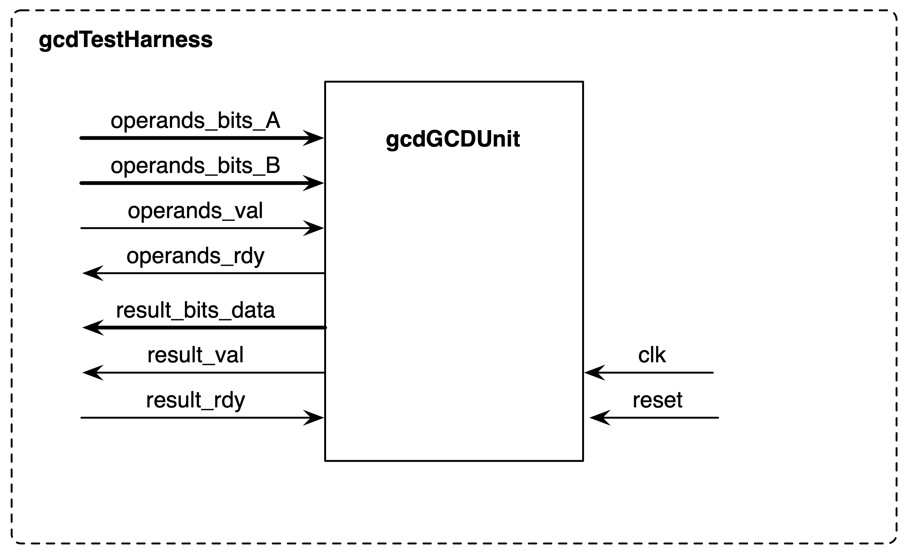

# EECS 151/251A ASIC Lab 3: Logic Synthesis
<p align="center">
Prof. Bora Nikolic
</p>
<p align="center">
TAs: Daniel Grubb, Nayiri Krzysztofowicz, Zhaokai Liu
</p>
<p align="center">
Department of Electrical Engineering and Computer Science
</p>
<p align="center">
College of Engineering, University of California, Berkeley
</p>


## Overview
For this lab, you will learn how to translate RTL code into a gate-level netlist in a process called
synthesis. In order to successfully synthesize your design, you will need to understand how to
constrain your design, learn how the tools optimize logic and estimate timing, analyze the critical
path of your design, and simulate the gate-level netlist.
To begin this lab, get the project files by typing the following commands:

```shell
git clone /home/ff/eecs151/labs/lab3.git
cd lab3
```

You should add the following lines to the `.bashrc` file in your home folder
(for more information about what `.bashrc` does, see https://www.tldp.org/LDP/abs/html/sample-bashrc.html)
so that every time
you open a new terminal you have the paths for the tools setup properly.

```shell
source /home/ff/eecs151/tutorials/eecs151.bashrc
export HAMMER_HOME=/home/ff/eecs151/hammer
source ${HAMMER_HOME}/sourceme.sh
```

Type

```shell
which genus
```

to see if the shell prints out the path to the Cadence Genus Synthesis program (which we will be
using for this lab). If it does not work, add the lines to your `.bash_profile` in your home folder
as well. Try log in or open a new terminal to see if it works. The file `eecs151.bashrc` sets various
environment variables in your system such as where to find the CAD programs or license servers.


## Synthesis Environment
To perform synthesis, we will be using Cadence Genus. However, we will not be interfacing with
Genus directly, we will rather use Hammer. Just like in lab 2, we have set up the basic Hammer
flow for your lab exercises using Makefile.

In this lab repository, you will see two sets of input files for Hammer. The first set of files are
the source codes for our design that you will explore in the next section. The second set of files are
some YAML files (`inst-env.yml`, `asap7.yml`, `design.yml`, `sim-rtl.yml`, `sim-gl-syn.yml`) that
configure the Hammer flow. Of these YAML files, you should only need to modify `design.yml`,
`sim-rtl.yml` and `sim-gl-syn.yml` in order to configurate to the synthesis and simulation for your
design.


Hammer is already setup at `/home/ff/eecs151/hammer` with all the required plugins for Cadence
Synthesis (Genus) and Place-and-Route (Innovus), Synopsys Simulator (VCS), Mentor Graphics
DRC and LVS (Calibre). You should not need to install it on your own home directory. **These
Hammer plugins are under NDA. They are provided to us for educational purpose.
They should never be copied outside of instructional machines under any circumstances or else we are at risk of unable to get access to the tools in the future!!!**

Let us take a look at some parts of `design.yml` file:

```yaml
gcd.clockPeriod: &CLK_PERIOD "1ns"
```

This option sets the target clock speed for our design. A more stringent target (a lower clock
period) will make the tool work harder and use higher-power gates to meet the clock
period. A lower target lets the tool focus on reducing area and/or power.
In the sim-rtl.yml:

```yaml
defines:
  - "CLOCK_PERIOD=1.00"
```

The option sets the clock period used during simulation. It is generally useful to separate the two as
you might want to see how the circuit performs under different clock frequencies without changing
the design constraints. Continuing from `design.yml`:

```yaml
gcd.verilogSrc: &VERILOG_SRC
  - "src/gcd.v"
  - "src/gcd_datapath.v"
  - "src/gcd_control.v"
```

and in `sim-rtl.yml`:

```yaml
sim.inputs:
  input_files:
    - "src/gcd.v"
    - "src/gcd_datapath.v"
    - "src/gcd_control.v"
    - "src/gcd_testbench.v"
```

These specify the files for synthesis and simulation. Moving on, we have:

```yaml
vlsi.inputs.clocks: [
  {name: "clk", period: *CLK_PERIOD, uncertainty: "0.1ns"}
]
```

This is where we specify to Hammer that we intend on using the `CLK_PERIOD` we defined earlier
as the constraint for our design. We will see more detailed constraints in the later labs.

## Understanding the example design
We have provided a circuit described in Verilog that computes the greatest common divisor (GCD)
of two numbers. Unlike the FIR filter from the last lab where the testbench constantly provided
stimuli, the GCD algorithm takes a variable number of cycles, so the testbench needs to know when
the circuit is done to check the output. This is accomplished through a “ready/valid” handshake
protocol. This protocol is very ubiquitous and a flavor of it will appear both in the class project
and later on in other blocks you will encounter throughout your career. The block diagram is shown
in the figure below.

<p align="center">

</p>

The GCD module declaration is as follows:

```v
module gcd#( parameter W = 16 )
(
  input clk, reset,
  input [W-1:0] operands_bits_A,    // Operand A
  input [W-1:0] operands_bits_B,    // Operand B
  input operands_val,               // Are operands valid?
  output operands_rdy,              // ready to take operands

  output [W-1:0] result_bits_data,  // GCD
  output result_val,                // Is the result valid?
  input result_rdy                  // ready to take the result
);
```

On the `operands` boundary, nothing will happen until GCD is ready to receive data (`operands_rdy`).
When this happens, the testbench will place data on the operands (`operands_bits_A` and `operands_bits_B`),
but GCD will not start until the testbench declares that these operands are valid (`operands_val`).
Then GCD will start.

The testbench needs to know that GCD is not done. This will be true as long as `result_val` is 0
(the results are not valid). Also, even if GCD is finished, it will hold the result until the testbench is
prepared to receive the data (`result_rdy`). The testbench will check the data when GCD declares
the results are valid by setting `result_val` to 1.

The main contract is that if the interface declares it is ready, and the other side declares valid, the
information must be transfered.

Open `src/gcd.v`. This is the top-level of GCD and just instantiates `gcd_control` and `gcd_datapath`.
Separating files into control and datapath is generally a good idea. Open `src/gcd_datapath.v`.
This file stores the operands, and contains the logic necessary to implement the algorithm (subtraction and comparison). Open `src/gcd_control.v`. This file contains a state machine that handles
the ready-valid interface and controls the mux selects in the datapath. Open `src/gcd_testbench.v`.
This file sends different operands to GCD, and checks to see if the correct GCD was found. Make
sure you understand how this file works. Note that the inputs are changed on the negative edge
of the clock. This will prevent hold time violations for gate-level simulation, because once a clock
tree has been added, the input flops will register data at a time later than the testbench’s rising
edge of the clock.

Now simulate the design by running `make sim-rtl`. The waveform is located under `build/sim-rundir/`.
Open the waveform in DVE (you may need to scroll down in DVE to find the testbench) and try
to understand how the code works by comparing the waveforms with the Verilog code. It might
help to sketch out a state machine diagram and draw the datapath.


### Question 1: Understanding the algorithm

By reading the provided Verilog code and/or viewing the RTL level simulations, demonstrate that
you understand the provided code:

**a.) Draw a table with 5 columns (cycle number, value of `A_reg`, value of `B_reg`, next value of `A_reg`, next value of `B_reg`) and fill in all of the rows for the first test vector (GCD of 27 and 15)**

**b) In `src/gcd_testbench.v`, the inputs are changed on the negative edge of the clock to prevent hold time violations. Is the output checked on the positive edge of the clock or the negative edge of the clock? Why?**

**c) In `src/gcd_testbench.v`, what will happen if you change `result_rdy = 1;` to `result_rdy = 0;`? What state will `gcd_control.v` state machine be in?**


### Question 2: Testbenches
**a) Modify `src/gcd_testbench.v` so that intermediate steps are displayed in the format below. Include a copy of the code you wrote in your writeup (this should be approximately 3-4 lines).**

```shell
 0: [ ...... ] Test ( x ), [ x == x ]  (decimal)
 1: [ ...... ] Test ( x ), [ x == 0 ]  (decimal)
 2: [ ...... ] Test ( x ), [ x == 0 ]  (decimal)
 3: [ ...... ] Test ( x ), [ x == 0 ]  (decimal)
 4: [ ...... ] Test ( x ), [ x == 0 ]  (decimal)
 5: [ ...... ] Test ( x ), [ x == 0 ]  (decimal)
 6: [ ...... ] Test ( 0 ), [ 3 == 0 ]  (decimal)
 7: [ ...... ] Test ( 0 ), [ 3 == 0 ]  (decimal)
 8: [ ...... ] Test ( 0 ), [ 3 == 27 ] (decimal)
 9: [ ...... ] Test ( 0 ), [ 3 == 12 ] (decimal)
10: [ ...... ] Test ( 0 ), [ 3 == 15 ] (decimal)
11: [ ...... ] Test ( 0 ), [ 3 == 3 ]  (decimal)
12: [ ...... ] Test ( 0 ), [ 3 == 12 ] (decimal)
13: [ ...... ] Test ( 0 ), [ 3 == 9 ]  (decimal)
14: [ ...... ] Test ( 0 ), [ 3 == 6 ]  (decimal)
15: [ ...... ] Test ( 0 ), [ 3 == 3 ]  (decimal)
16: [ ...... ] Test ( 0 ), [ 3 == 0 ]  (decimal)
17: [ ...... ] Test ( 0 ), [ 3 == 3 ]  (decimal)
18: [ passed ] Test ( 0 ), [ 3 == 3 ]  (decimal)
19: [ ...... ] Test ( 1 ), [ 7 == 3 ]  (decimal)
```
## Synthesis
Synthesis is the process of converting RTL Verilog files into technology (or platform, in the case of
FPGAs) specific gate-level Verilog. These gates are different from the “and”, “or”, “xor” etc. primitives in Verilog. While the logic primitives correspond to gate-level operations, they do not have
a physical representation outside of their symbol. A synthesized gate-level Verilog only contains
cells with corresponding physical aspects: they have a transistor-level schematic with transistor
sizes provided, a physical layout containing information necessary for fabrication, timing libraries
providing performance specifications etc. Some synthesis tools also output assign statements that
refer to pass-through interfaces, but no logic operation is performed in these assignments (not even
simple inversion!).


Open the Makefile to see the available targets that you can run. You don’t have to know all of
these for now. The Makefile provides shorthands to various Hammer commands for synthesis,
placement-and-routing, or simulation. Read [Hammer-Flow](https://hammer-vlsi.readthedocs.io/en/latest/Hammer-Flow/index.html) if you want to get more detail.

To start the synthesis process of the GCD module you just analyzed, the first step is to make
Hammer generate the necessary supplement Makefile (`build/hammer.d`). To do so, type the
following command in the lab directory:

    make buildfile

This generates a file with make targets specific to the constraints we have provided inside the YAML
files. If you have not run `make clean` after simulating, this file should already be generated. `make buildfile` also copies and extracts a tarball of the ASAP7 PDK to your local workspace. It will
take a while to finish if you run this command first time. The extracted PDK is not deleted when
you do `make clean` to avoid unnecessarily rebuilding the PDK. To explicitly remove it, you need to
remove the build folder (and you should do it once you finish the lab to save your allocated disk
space since the PDK is huge). To synthesize the GCD, use the following command:

    make syn

This runs through all the steps necessary to generate the gate-level Verilog. The final lines of output
you will see is a list of all the registers in the design. There should be all the bits of `A_reg_reg`,
`B_reg_reg` and state registers.

By default, Hammer puts the generated objects under the directory build. Go to `build/syn-rundir/reports`. 
There are five text files here that contain very useful information about
the synthesized design that we just generated. Go through these files and familiarize yourself with
these reports. One report of particular note is `final_time_PVT_0P63V_100C.setup.view.rpt`. The
name of this file represents that it is a timing report, with the Process Voltage Temperature corner
of 0.63 V and 100 degrees C, and that it contains the setup timing checks. Another important file
is `build/syn-rundir/gcd.mapped.v`. This is your synthesized gate-level Verilog. Go through it
to see what the RTL design has become to represent it in terms of technology-specific gates. Try
to follow an input through these gates to see the path it takes until the output. While these files
are rarely ever read by humans, you may sometimes find yourself going through these during the
process of debugging.

Now open the `final_time_PVT_0P63V_100C.setup.view.rpt` file and look at the first block of text
you see. It should look similar to this:

```text
Path 1: MET (474 ps) Setup Check with Pin GCDdpath0/A_reg_reg[15]/CLK->D
View: PVT_0P63V_100C.setup_view
Group: clk
Startpoint: (R) GCDdpath0/B_reg_reg[5]/CLK
Clock: (R) clk
Endpoint: (F) GCDdpath0/A_reg_reg[15]/D
Clock: (R) clk
Capture Launch
Clock Edge:+ 1000 0
Src Latency:+ 0 0
Net Latency:+ 0 (I) 0 (I)
Arrival:= 1000 0
Setup:- 25
Uncertainty:- 0
Required Time:= 975
Launch Clock:- 0
Data Path:- 501
Slack:= 474
#---------------------------------------------------------------------------------------------------------------------
# Timing Point Flags Arc Edge Cell Fanout Load Trans Delay Arrival Instance
# (fF) (ps) (ps) (ps) Location
#---------------------------------------------------------------------------------------------------------------------
GCDdpath0/B_reg_reg[5]/CLK - - R (arrival) 16 - 0 - 0 (-,-)
GCDdpath0/B_reg_reg[5]/QN - CLK->QN R ASYNC_DFFHx1_ASAP7_75t_SL 5 3.3 42 48 48 (-,-)
GCDdpath0/g1181/Y - A->Y F INVx1_ASAP7_75t_SL 2 1.2 20 10 58 (-,-)
GCDdpath0/g1162__8246/Y - A->Y F OR2x2_ASAP7_75t_SL 2 1.3 12 17 76 (-,-)
GCDdpath0/g1152__6260/Y - A1->Y F AO32x1_ASAP7_75t_SL 1 0.7 13 19 95 (-,-)
GCDdpath0/g1144__2883/Y - C1->Y R AOI322xp5_ASAP7_75t_SL 1 0.7 47 19 114 (-,-)
GCDdpath0/g1138__5115/Y - B2->Y F AOI221xp5_ASAP7_75t_SL 1 0.7 37 14 128 (-,-)
GCDdpath0/g1137__1881/Y - A2->Y R O2A1O1Ixp33_ASAP7_75t_SL 3 2.2 72 36 164 (-,-)
GCDctrl0/g446__5526/Y - B->Y F NAND2xp5_ASAP7_75t_SL 2 1.3 36 17 182 (-,-)
GCDctrl0/g444/Y - A->Y R INVx1_ASAP7_75t_SL 18 10.0 102 52 234 (-,-)
GCDdpath0/g1265/Y - A->Y F INVx1_ASAP7_75t_L 17 9.4 91 63 297 (-,-)
GCDdpath0/g1232__9945/Y - B->Y R NOR2xp33_ASAP7_75t_L 16 9.0 304 154 451 (-,-)
GCDdpath0/g1193__6417/Y - C1->Y F AOI222xp33_ASAP7_75t_SL 1 0.7 124 51 501 (-,-)
GCDdpath0/A_reg_reg[15]/D - - F ASYNC_DFFHx1_ASAP7_75t_SL 1 - - 0 501 (-,-)
#---------------------------------------------------------------------------------------------------------------------
```

This is one of the most common ways to assess the critical paths in your circuit. 
The setup timing report lists each timing path's **slack**, which is the extra delay the signal can have before a setup
violation occurs, in ascending order. So the first block indicates the critical path of the design.
Each row represents a timing path from a gate to the next, and the whole block is the **timing
arc** between two flip-flops (or in some cases between latches). The `MET` at the top of the block
indicates that the timing requirements have been met and there is no violation. If there was, this
indicator would have read `VIOLATED`. Since our critical path meets the timing requirements with
a 474 ps of slack, this means we can run this synthesized design with a period equal to clock period
(1000 ps) minus the critical path slack (474 ps), which is 526 ps.

### Question 3: Reporting Questions
**a) Which report would you look at to find the total number of each different standard cell that the design contains?**

**b) Which report contains area breakdown by modules in the design?**

**c) What is the cell used for `A_reg_reg[7]`? How much leakage power does this contribute? How did you find this?**

### Question 4: Synthesis Questions
**a) Looking at the total number of sequential cells synthesized and the number of `reg` definitions in the Verilog files, are they consistent? If not, why?**

**b) Modify the clock period in the `design.yml` file to make the design go faster. What is the highest clock frequency this design can operate at in this technology?**

### Synthesis: Step-by-step

While for the remainder of the semester we will be roughly following the above section’s flow, it is
useful as a digital IC design engineer to know what is going on during the process. In this section,
we will look at the steps Hammer takes to get from RTL Verilog to all the outputs we saw in the
last section.

First, type `make clean` to clean the environment of previous build’s files. Then, use `make buildfile`
to generate the supplementary Makefile as before. Now, we will modify the `make syn` command to
only run the steps we want. Go through the following commands in the given order:

    make redo-syn HAMMER_EXTRA_ARGS="--stop_after_step init_environment"

Hammer flow will exit with an error. This is expected, as Hammer looks for the final output
files to gauge its success. We have not yet generated the gate-level Verilog, so we know beforehand
that every step except the last one is going to end with an error. In this step, Hammer invokes
Genus to read the technology libraries and the RTL Verilog files, as well as the constraints we
provided in the `design.yml` file.

    make redo-syn HAMMER_EXTRA_ARGS="--stop_after_step syn_generic"

This step is the **generic synthesis** step. In this step, Genus converts our RTL Verilog files read
in the previous step to an intermediate format, using technology-independent generic gates. These
gates are purely for gate-level functional representation of the RTL we have coded, and are going
to be used as an input to the next step. This step also performs logical optimizations on our design
to eliminate any redundant/unused operations.

    make redo-syn HAMMER_EXTRA_ARGS="--stop_after_step syn_map"

This step is the **mapping** step. Genus takes its own generic gate-level output and converts it to
our ASAP7-specific gates. This step further optimizes the design given the gates in our technology.
That being said, this step can also increase the number of gates from the previous step as not
all gates in the generic gate-level Verilog may be available for our use and they may need to be
constructed using several, simpler gates.

    make redo-syn HAMMER_EXTRA_ARGS="--stop_after_step add_tieoffs"

In some designs, the pins in certain cells are hardwired to 0 or 1. Since modern technology does
not directly connect cells to Vdd or ground, the tie-off cells are added in this step.

    make redo-syn HAMMER_EXTRA_ARGS="--stop_after_step write_regs"

This step is purely for the benefit of the designer. For some designs, we may need to have a list
of all the registers in our design. In this lab, the list of regs is used in post-synthesis simulation to
generate the `force_regs.ucli`, which sets initial states of registers.

    make redo-syn HAMMER_EXTRA_ARGS="--stop_after_step generate_reports"

The reports we have seen in the previous section are generated during this step.

    make redo-syn HAMMER_EXTRA_ARGS="--stop_after_step write_outputs"

This step writes the outputs of the synthesis flow. This includes the gate-level `.v` file we looked at
earlier in the lab. Other outputs include the design constraints (such as clock frequencies, output
loads etc., in `.sdc` format) and delays between cells (in `.sdf` format).

## Post-Synthesis Simulation
From the root folder, type the following commands:

    make sim-gl-syn
    
This will run a post-synthesis simulation using annotated delays from the `gcd.mapped.sdf` file.

### Question 5: Delay Questions
**a) Check the waveforms in DVE. Submit a screenshot and report the clk-q delay of `state[0]` in `GCDctrl0` at 17.5 ns. Which line in the sdf file specifies this delay?**

## Build Your Divider
Now that you understand how to use the tools to synthesize and simulate the GCD implementation.
In this section, you will build a parameterized divider of unsigned integers. Some initial code has
been provided to you to get started. To keep the control logic simple, the divider module uses input
signal `start` to begin the computation at the next clock cycle, and asserts output signal `done` to
HIGH when the division result is valid. The input `dividend` and `divisor` should be registered
when `start` is HIGH. You are not required to handle corner cases such as dividing by 0. You are
free to modify the skeleton code to adopt ready/valid instead, but it is not required.

It is suggested that you implement the divide algorithm described [here](http://bwrcs.eecs.berkeley.edu/Classes/icdesign/ee141_s04/Project/Divider%20Background.pdf). Use the **Divide Algorithm Version 2** (slide 9).
A simple testbench skeleton is also provided to you. You should change it to add more test vectors,
or test your divider with different bitwidths. You need to change the file `sim-rtl.yml` to use your
divider instead of the GCD module when testing.

### Question 6: Hammer your divider
**1. Push your 4-bit divider design through the tools, and determine its critical path, cell area, and maximum operating frequency from the reports. You might need to rerun synthesis multiple times to determine the maximum achievable frequency.**

**2. Change the bitwidth of your divider to 32-bit, what is the critical path, area, and maximum operating frequency now?**

**3. Submit your divider code and testbench to the report. Add comments to explain your testbench and why it provides sufficient coverage for your divider module.**

## Lab Deliverables

### Lab Due: 11:59 PM, Friday September 24th, 2021

- Submit a written report with all 6 questions answered to Gradescope
- Checkoff with an ASIC lab TA

## Acknowledgement

This lab is the result of the work of many EECS151/251 GSIs over the years including:
Written By:
- Nathan Narevsky (2014, 2017)
- Brian Zimmer (2014)
Modified By:
- John Wright (2015,2016)
- Ali Moin (2018)
- Arya Reais-Parsi (2019)
- Cem Yalcin (2019)
- Tan Nguyen (2020)
- Harrison Liew (2020)
- Sean Huang (2021)
- Daniel Grubb, Nayiri Krzysztofowicz, Zhaokai Liu (2021)
