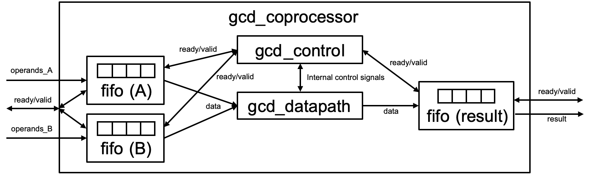
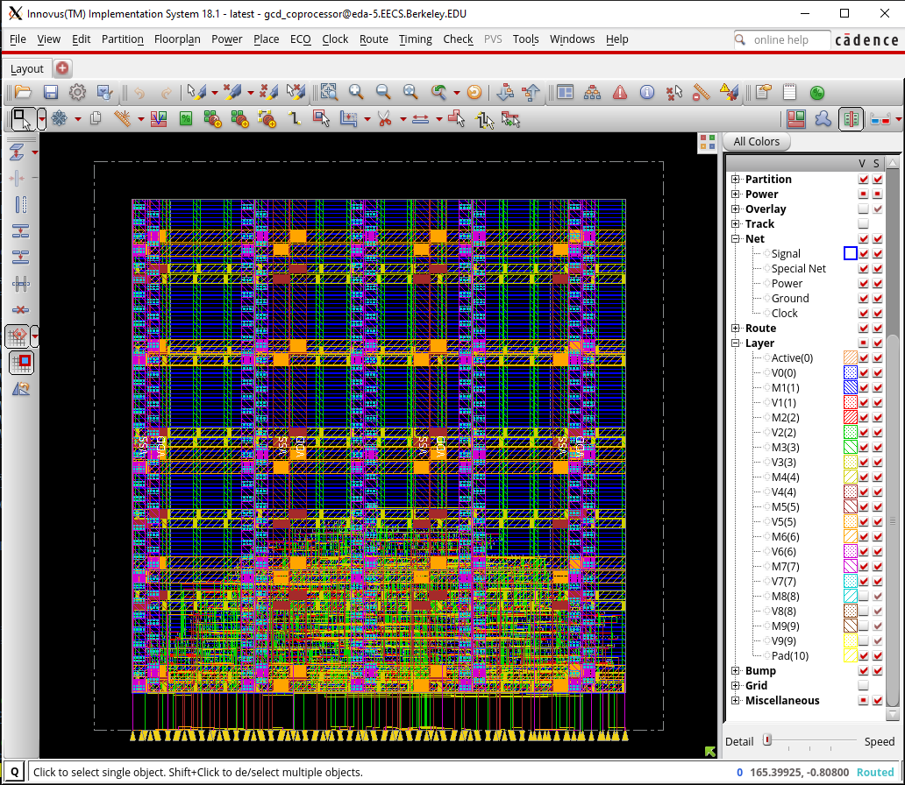
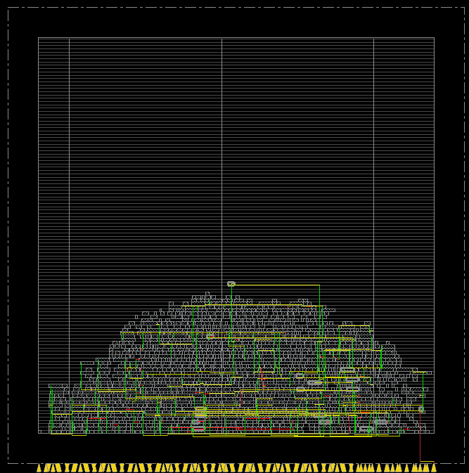
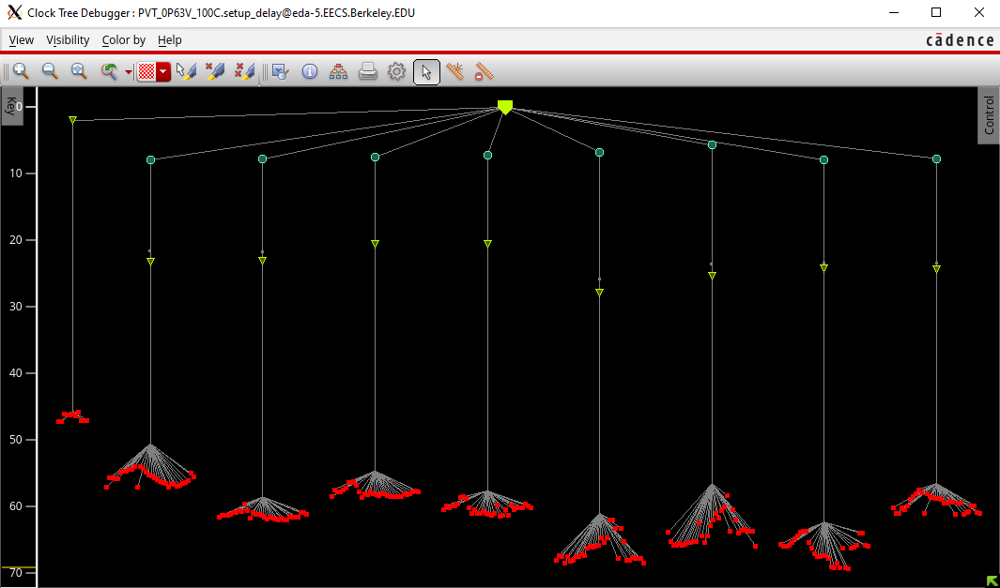
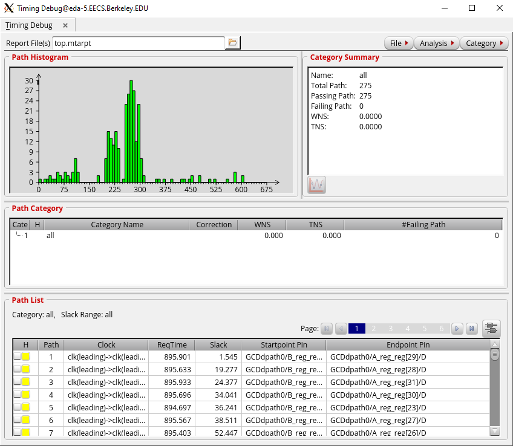
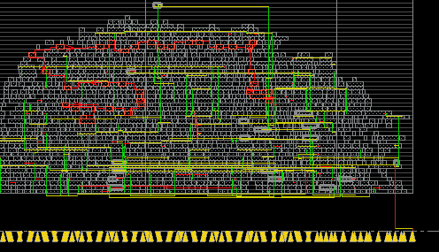

# EECS 151/251A ASIC Lab 4: Floorplanning, Placement, Power, and CTS

<p align="center">
Prof. Bora Nikolic
</p>
<p align="center">
TAs: Daniel Grubb, Nayiri Krzysztofowicz, Zhaokai Liu
</p>
<p align="center">
Department of Electrical Engineering and Computer Science
</p>
<p align="center">
College of Engineering, University of California, Berkeley
</p>

## Overview
This lab consists of three parts. For the first part, you will be writing a GCD coprocessor that could be included alongside a general-purpose CPU (like your final project). You will then learn how the tools can create a floorplan, route power straps, place standard cells, perform timing optimizations, and generate a clock tree for your design. Finally, you will get a slight head start on your project by writing part of the ALU.

To begin this lab, get the project files and set up your environment by typing the following command and sourcing the `eecs151.bashrc` file, as usual:

```shell
git clone /home/ff/eecs151/labs/lab4.git
```

You should also clean up the build directory generated from the previous labs to save some disk space.

## Writing Your Coprocessor

Take a look at the `gcd_coprocessor.v` file in the src folder. You will see the following empty Verilog module.

```verilog
module gcd_coprocessor #( parameter W = 32 )(
  input clk,
  input reset,
  input operands_val,
  input [W-1:0] operands_bits_A,
  input [W-1:0] operands_bits_B,
  output operands_rdy,
  output result_val,
  output [W-1:0] result_bits,
  input result_rdy
);

// You should be able to build this with only structural verilog!
// Define wires
// Instantiate gcd_datapath
// Instantiate gcd_control
// Instantiate request FIFO
// Instantiate response FIFO

endmodule

```
First notice the parameter `W`. `W` is the data width of your coprocessor; the input data and output data will all be this bitwidth. Be sure to pass this parameter on to any submodules that may use it! You should implement a coprocessor that can handle 4 outstanding requests at a time. For now, you will use a FIFO (First-In, First-Out) block to store requests (operands) and responses (results).

A FIFO is a sequential logic element which accepts (enqueues) valid data and outputs (dequeues) it in the same order when the next block is ready to accept. This is useful for buffering between the producer of data and its consumer. When the input data is valid (`enq_val`) and the FIFO is ready for data (`enq_rdy`), the input data is enqueued into the FIFO. There are similar signals for the output data. This interface is called a “decoupled” interface, and if implemented correctly it makes modular design easy (although sometimes with performance penalties).

This FIFO is implemented with a 2-dimensional array of data called `buffer`. There are two pointers: a read pointer `rptr` and a write pointer `wptr`. When data is enqueued, the write pointer is incremented. When data is dequeued, the read pointer is incremented. Because the FIFO depth is a power of 2, we can leverage the fact that addition rolls over and the FIFO will continue to work. However, once the read and write pointers are the same, we don’t know if the FIFO is full or empty. We fix this by writing to the `full` register when they are the same and we just enqueued, and clearing the `full` register otherwise.

A partially written FIFO has been provided for you in `fifo.v`. Using the information above, complete the FIFO implementation so that it behaves as expected.


Then, finish the coprocessor implementation in `gcd_coprocessor.v`, so that the GCD unit and FIFOs are connected like in the following diagram. Note the connection between the `gcd_datapath` and `gcd_control` should be very similar to that in Lab 3’s `gcd.v` and that clock and reset are omitted from the diagram. You will need to think about how to manage a ready/valid decoupled interface with 2 FIFOs in parallel.


<p align="center">

</p>

A testbench has been provided for you (`gcd_coprocessor_testbench.v`). You can run the testbench to test your code by typing `make sim-rtl` in the root directory as before.

---
### Question 1: Design

a) Submit your code (`gcd_coprocessor.v` and `fifo.v`) and show that your code works (VCS output is fine)

---

## Introducing Place and Route

In this lab, you will begin to implement your GCD coprocessor in physical layout–the next step towards making it a real integrated circuit. Place & Route (P&R or PAR) itself is a much longer process than synthesis, so for this lab we will look at the first few steps: floorplanning, placement, power straps, and clock tree synthesis (CTS). The rest will be introduced in the next lab.

### Setting up for P&R

We will first bring our design to the point we stopped in Lab 3. Synthesize your design:


```shell
make syn
```

Before proceeding, make sure your design meets timing at the default 1ns clock period.

### Floorplanning & Placement
Floorplanning is the process of allocating area to the design and constraining how the area is utilized. Floorplanning is often the most important factor for determining a physical circuit’s performance, because intelligent floorplanning can assist the tool in minimizing the delays in the design, especially if the total area is highly constrained.

Floorplan constraints can be “hard” or “soft”. “Hard” constraints generally involve pre-placement of “macros”, which can be anything from memory elements (SRAM arrays, in an upcoming lab) to analog black boxes (like PLLs or LDOs). “Soft” constraints are generally guided placements of hierarchical modules in the design (e.g. the datapath, controller, and FIFOs in your coprocessor), towards certain regions of the floorplan. Generally, the P&R tool does a good job of placing hierarchical modules optimally, but sometimes, a little human assistance is necessary to eke out the last bit of performance.

In this lab, we will just look at allocating a custom sized area to our design, specified in the `design.yml` file. Open up this file and locate the following text block:

```verilog
# Placement Constraints
vlsi.inputs.placement_constraints:
  - path: "gcd_coprocessor"
    type: "toplevel"
    x: 0
    y: 0
    width: 150
    height: 150
    margins:
left: 10
      right: 10
      top: 10
      bottom: 10
  - path: "gcd_coprocessor/GCDpath0"
    type: "placement"
    x: 50
    y: 50
    width: 50
    height: 50
# Pin Placement Constraints
vlsi.inputs.pin_mode: generated
vlsi.inputs.pin.generate_mode: semi_auto
vlsi.inputs.pin.assignments: [
  {pins: "*", layers: ["M5", "M7"], side: "bottom"}
]
```

The `vlsi.inputs.placement_constraints` block specifies 2 floorplan constraints. The first one denotes the origin `(x, y)`, size `(width, height)` and border margins of the top-level block `gcd_coprocessor`. The second one denotes a soft placement constraint on the GCD datapath to be roughly in the center of the floorplan. For complicated designs, floorplans of major modules are often defined separately, and then assembled together hierarchically.

Pin constraints are also shown here. All that we need to see is that all pins are located at the bottom boundary of the design, on Metal 5 and Metal 7 layers. Pin placement becomes very important in a hierarchical design, if modules need to abut each other.

Placement is the process of placing the synthesized design (structural connection of standard cells) onto the specified floorplan. While there is placement of minor cells (such as bulk connection cells, antenna-effect prevention cells, I/O buffers...) that take place separately and in between various stages of design, “placement” usually refers to the initial placement of the standard cells.

After the cells are placed, they are not “locked”–they can be moved around by the tool during subsequent optimization steps. However, initial placement tries its best to place the cells optimally, obeying the floorplan constraints and using complex heuristics to minimize the parasitic delay caused by the connecting wires between cells and timing skew between synchronous elements (e.g. flip-flops, memories). Poor placement (as well as poor aspect ratio of the floorplan) can result in congestion of wires later on in the design, which may prevent successful routing.

### Power


In the middle of the `asap7.yml` file, you will see this block, which contains parameters to HAMMER’s power strap auto-calculation API:

```verilog
# Power Straps
par.power_straps_mode: generate
par.generate_power_straps_method: by_tracks
par.blockage_spacing: 2.0
par.generate_power_straps_options:
by_tracks:
strap_layers:
    - M3
    - M4
    - M5
    - M6
    - M7
    - M8
    - M9
track_width: 14
track_width_M3: 7
track_width_M5: 24
track_width_M8: 6
track_width_M9: 6
track_spacing: 0
power_utilization: 0.25
power_utilization_M8: 1.0
power_utilization_M9: 1.0
```


Power must be delivered to the cells from the topmost metal layers all the way down to the transistors, in a fashion that minimizes the overall resistance of the power wires without eating up all the resources that are needed for wiring the cells together. You will learn about power distribution briefly at the end of this course’s lectures, but the preferred method is to place interconnected grids of fat wires on every metal layer. There are tools to check the quality of the `power_distribution` network, which like the post-P&R simulations you did in Lab 2, calculate how the current being drawn by the circuit is transiently distributed across the power grid.

You should not need to touch this block of yaml, because the parameters are tuned for meeting design rules in this technology. However, the important parameter is `power_utilization`, which specifies that approximately 25% of the available routing space on each metal layer should be reserved for power, with the exception of Metals 8 and 9, which should have 100% coverage.

### Clock Tree Synthesis (CTS): Overview

Clock Tree Synthesis (CTS) is arguably the next most important step in P&R behind floorplanning. Recall that up until this point, we have not talked about the clock that triggers all the sequential logic in our design. This is because the clock signal is assumed to arrive at every sequential element in our design at the same time. The synthesis tool makes this assumption and so does the initial cell placement algorithm. In reality, the sequential elements have to be placed wherever makes the most sense (e.g. to minimize delays between them). As a result, there is a different amount of delay to every element from the top-level clock pin that must be “balanced” to maintain the timing results from synthesis. We shall now explore the steps the P&R tool takes to solve this problem and why it is called Clock Tree Synthesis.

### Pre-CTS Optimization

Pre-CTS optimization is the first round of Static Timing Analysis (STA) and optimization performed on the design. It has a large freedom to move the cells around to optimize your design to meet setup checks, and is performed after the initial cell placement. Hold errors are not checked during pre-CTS optimization. Because we do not have a clock tree in place yet, we do not know when the clocks will arrive to each sequential element, hence we don’t know if there are hold violations. The tool therefore assumes that every sequential element receives the clock ideally at the same time, and tries to balance out the delays in data paths to ensure no setup violations occur. In the end, it generates a timing report, very similar to the ones we saw in the last lab.

### Clock Tree Clustering and Balancing
Most of CTS is accomplished after initial optimization. The CTS algorithm first clusters groups of sequential elements together, mostly based on their position in the design relative to the top-level clock pin and common clock gating logic. The numbers of elements in each cluster is selected so that it does not present too large of a load to a driving cell. These clusters of sequential elements are the “leaves” of the clock tree attached to branches.

Next, the CTS algorithm tries to ensure that the delay from the top-level clock pin to the leaves are all the same. It accomplishes this by adding and sizing clock buffers between the top-level pin and the leaves. There may be multiple stages of clock buffering, depending on how physically large the design is. Each clock buffer that drives multiple loads is a branching point in the clock tree, and strings of clock buffers in a row are essentially the “trunks”. Finally, the top-level clock pin is considered the “root” of the clock tree.

The CTS algorithm may go through many iterations of clustering and balancing. It will try to minimize the depth of the tree (called *insertion delay*, i.e. the delay from the root to the leaves) while simultaneously minimizing the *skew* (difference in insertion delay) between each leaf in the tree. The deeper the tree, the harder it is to meet both setup and hold timing (*thought experiment #1*: why is this?).

### Post-CTS Optimization
Post-CTS optimization is then performed, where the clock is now a real signal that is being distributed unequally to different parts of the design. In this step, the tool fixes setup and hold time violations simultaneously. Often times, fixing one error may introduce one or multiple errors (*thought experiment #2*: why is this?), so this process is iterative until it reaches convergence (which may or may not meet your timing constraints!). Fixing these violations involve resizing, adding/deleting, and even moving the logic and clock cells.

After this stage of optimization, the clock tree and clock routing are fixed. In the next lab, you will finish the P&R flow, which finalizes the rest of the routing, but it is usually the case that if your design is unable to meet timing after CTS, there’s no point continuing!

## Compiling the Design with HAMMER

Now that we went over the flow (at least at a high level), it is time to actually perform these steps. Type the following commands to perform the above described operations:

```shell
make syn-to-par
make redo-par HAMMER_EXTRA_ARGS="--stop_after_step clock_tree"
```


The first command here translates the outputs of the synthesis tool to conform to the inputs expected by the P&R tool. The second command is similar to the partial synthesis commands we used in the last lab. It tells HAMMER to do the PAR flow until it finishes CTS, then stop. Under the hood, for this lab, HAMMER uses Cadence Innovus as the back-end tool to perform P&R. HAMMER waits until Innovus is done with the P&R steps through post-CTS optimization, then exits. You will see that HAMMER again gives you an error - similar to last lab when HAMMER expected a synthesized output, this time HAMMER expects the full flow to be completed and gives an error whenever it can’t find some collateral expected of P&R.

Once done, look into the `build/par-rundir` folder. Similar to how all the synthesis files were placed under `build/syn-rundir` folder in the previous lab, this folder holds all the P&R files. Go ahead and open `par.tcl` file in a text editor. HAMMER generated this file for Innovus to consume in batch mode, and inside are Innovus Common UI commands as a TCL script.

While we will be looking through some of these commands in a bit, first take a look at `timingReports`. You should only see the pre-CTS timing reports. `gcd_coprocessor_preCTS_all.tarpt.gz` contains the report in a g-zipped archive. The remaining files also contain useful information regarding capacitances, length of wires etc. You may view these directly using Vim, unzip them using `gzip`, or navigate through them with Caja, the file browser.

Going back a level, in `par-rundir`, the folder `hammer_cts_debug` has the post-CTS timing reports. The two important archives are `hammer_cts_all.tarpt.gz` and `hammer_cts_all_hold.tarpt.gz`. These contain the setup and hold timing analyses results after post-CTS optimization. Look into the hold report (you may actually see some violations!). However, any violation should be small (<1 ps) and because we have a lot of margins during design (namely the `design.yml` file has “clock uncertainty” set to 100 ps), these small violations are not of concern, but should still be investigated in a real design.

## Visualizing the Results

From the `build/par-rundir` folder, execute the following in a terminal with graphics (X2Go highly recommended for low latency):

```shell
./generated-scripts/open_chip
```
The Innovus GUI will pop up with your layout and your terminal is now the Innovus shell. After the window opens, click anywhere inside the black window at the center of the GUI and press “F” to zoom-to-fit. You should see your entire design, which should look roughly similar to the one below once you disable the V8, M8, V9, and M9 layers (because recall that the power straps in these metal layers were set to 100% coverage) using the right panel by unchecking their respective boxes under the “V” column:

<p align="center">

</p>


Take a moment to familiarize yourself with the Innovus GUI. You should also toggle between the floorplan, amoeba, and placement views using the buttons that look like this:   and examine how the actual placement of the GCD datapath in ameoba view doesn’t follow our soft placement guidance in floorplan view. This is because our soft placement guidance clearly places the datapath farther away from the pins and would result in a worse clock tree!

Now, let’s take a look at the clock tree a couple different ways. In the right panel, under the “Net” category, hide from view all the types of nets except “Clock”. Your design should now look approximately like this, which shows the clock tree routing:

<p align="center">

</p>


We can also see the clock tree in its “tree” form by going to the menu Clock → CCOpt Clock Tree Debugger and pressing OK in the popup dialog. A window should pop up looking approximately like this:

<p align="center">

</p>


The red dots are the “leaves”, the green triangles are the clock buffers, the blue dots are clock gates (they are used to save power), and the green pin on top is the clock pin or the clock “root”. The numbers on the left side denote the insertion delay in ps.

Now, let’s visualize our critical path. Go to the menu Timing → Debug Timing and press OK in the popup dialog. A window will pop up that looks approximately like this:

<p align="center">

</p>

Examine the histogram. This shows the number of paths for every amount of slack (on the x-axis), and you always want to see a green histogram! The shape of the histogram is a good indicator of how good your design is and how hard the tool is working to meet your timing constraints (*thought experiment #3:* how so, and what would be the the ideal histogram shape?).

Now right-click on Path 1 in this window (the critical path), select Show Timing Analyzer and Highlight Path, and select a color. A window will pop up, which is a graphical representation of the timing reports you saw in the hammer cts debug folder. Poke around the tabs to see all the different representations of this critical path. Back in the main Innovus window, the critical path will be highlighted, showing the chain of cells along the path and the approximate routing it takes to get there, which may look something like this:

<p align="center">

</p>

---

### Question 2: Interpreting P&R Timing Reports
a) What is the critical path of your design pre- and post-CTS? Is it the same as the post-synthesis critical path?

b) Look in the post-CTS text timing report (`hammer_cts_debug/hammer_cts.all.tarpt`). Find a path inside which the same cell is used more than once. Identify the delay of those instances of that common cell. Can you explain why they are different?

c) What is the skew between the clock that arrives at the flip-flops at the beginning and end of the post-CTS critical path? Does this skew help or hurt the timing margin calculation?

d) (UNGRADED thought experiment #1) Why is it harder to meet both setup and hold timing constraints if the clock tree has large insertion delay?

e) (UNGRADED thought experiment #2) Why does fixing one setup or hold error introduce one or multiple errors? Is it more likely to produce an error of the same, or different type, and why?

f) (UNGRADED thought experiment #3) P&R tools have a goal to minimize power while ensuring that all paths have have >0ps of slack. What might a timing path histogram look like in a design that has maximized the frequency it can run at while meeting this goal? Given the histogram obtained here, does it look we can increase our performance? What might we need to improve/change?

---

When you are done, you may exit Innovus by closing the GUI window.
## Under the Hood: Innovus
While HAMMER obfuscates a lot from the end-user in terms of tool-based commands, most IC companies directly interface with Innovus and it is useful to know what tool-specific commands you are running in case you need to debug your circuit step-by-step. Therefore, we will now look into par.tcl and follow along using Innovus. Make sure you are in the directory `build/par-rundir` and type:

```shell
innovus -common_ui
```
Now, follow `par.tcl` command-by-command, copying and pasting the commands to the Innovus shell and looking at the GUI for any changes. You may skip the `puts` commands as they just tell the tool to print out what its doing, and the `write_db` commands which write a checkpoint database between each step of the P&R flow. The steps that you will see significant changes are listed below. As you progress through the steps, feel free to zoom in to investigate what is going on with the design, look at the extra TCL files that are sourced, and cross-reference the commands with the command reference manual at `/home/ff/eecs151/labs/manuals/TCRcom.pdf`.

1. After the command sourcing `floorplan.tcl`
2. After the command sourcing power `straps.tcl`
3. After the command `edit pin`
4. After the command `place_opt_design`

After the `ccopt_design` command is run, you may see a bunch of white X markers on your design. These are some Design Rule Violations (DRVs), indicating Innovus didn’t quite comply with the technology’s requirements. Ignore these for the purposes of this lab.

---

### Question 3: Understanding P&R Steps

a) Submit a snapshot of your design for each of the four steps described above (use whichever Innovus view you deem is most appropriate to show the changes of each step). Make sure the V8 M8 V9 M9 layers are not visible, and your design is zoomed-to-fit. Describe how the design layout changes for each major step in their respective figure captions.

b) Examine the power straps on M1, in relation to the cells. You will need to zoom in far enough to see the net label on the straps. What does their pattern tell you about how digital standard cells are constructed?

c) Take a note of the orientations of power straps and routing metals. If you were to place pins on the right side of this block instead of the bottom, what metal layers could they be on?

---

Now zoom in to one of the cells and click the box next to “Cell” on the right panel of the GUI. This will show you the internal routing of the standard cells. While by default we have this off, it may prove useful when investigating DRVs in a design. You can now exit the application by closing the GUI window.

## Project Preparation
---
### Question 4: ALU
In this question, you will be designing and testing an ALU for later use in the semester. A header file containing define statements for operations (`ALUop.vh`) is provided inside the `src` directory of this lab. This file has already been included in an ALU template given to you in the same folder (`ALU.v`), but you may need to modify the include statement to match the correct path of the header file. Compare ALUop input of your ALU to the define statements inside the header file to select the function ALU is currently running. Definition of the functions is given below:
  
| Op Code |                         Definition                        |
|:-------:|:---------------------------------------------------------:|
|   ADD   |                        Add A and B                        |
|   SUB   |                     Substrate B from A                    |
|   AND   |                    Bitwise `and` A and B                    |
|    OR   |                     Bitwise `or` A and B                    |
|   XOR   |                    Bitwise `xor` A and B                    |
|   SLT   |        Perform a signed comparison, Out=1 if  A < B       |
|   SLTU  |      Perform an unsigned comparison, Out = 1 if A < B     |
|   SLL   |   Logical shift left A by an amount indicated by B[4:0]   |
|   SLA   | Arithmetic shift right A by an amount indicated by B[4:0] |
|   SRL   |   Logical shift right A by an amount indicated by B[4:0]  |
|  COPY_B |                    Output is equal to B                   |
|   XXX   |                        Output is 0                        |

Given these definitions, complete `ALU.v` and write a testbench tb `ALU.v` that checks all these oper- ations with random inputs at least a 100 times per operation and outputs a PASS/FAIL indicator. For this lab, we will only check for effort and not correctness, but you will need it to work later!

---

## Lab Deliverables

### Lab Due: 11:59 PM, Friday October 1st, 2021

- Submit a written report with all 4 questions answered to Gradescope
- Checkoff with an ASIC lab TA

## Acknowledgement

This lab is the result of the work of many EECS151/251 GSIs over the years including:
Written By:
- Nathan Narevsky (2014, 2017)
- Brian Zimmer (2014)
Modified By:
- John Wright (2015,2016)
- Ali Moin (2018)
- Arya Reais-Parsi (2019)
- Cem Yalcin (2019)
- Tan Nguyen (2020)
- Harrison Liew (2020)
- Sean Huang (2021)
- Daniel Grubb, Nayiri Krzysztofowicz, Zhaokai Liu (2021)
