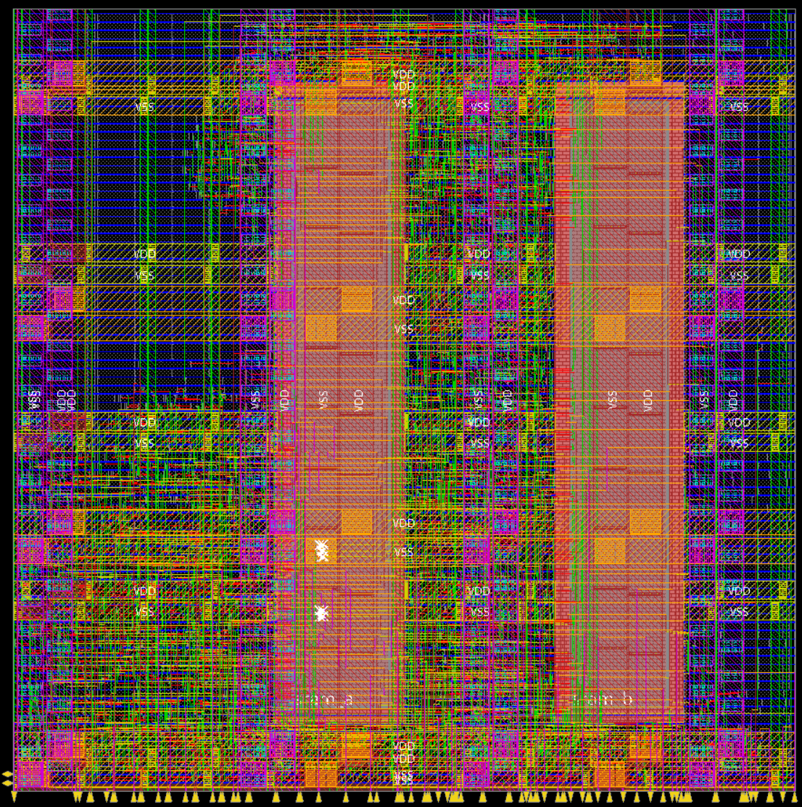
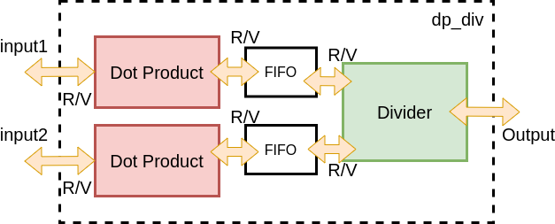
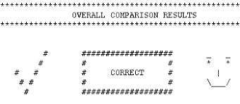

# EECS 151/251A ASIC Lab 6: SRAM Integration, DRC, LVS

<p align="center">
Prof. Bora Nikolic
</p>
<p align="center">
TAs: Daniel Grubb, Nayiri Krzysztofowicz, Zhaokai Liu
</p>
<p align="center">
Department of Electrical Engineering and Computer Science
</p>
<p align="center">
College of Engineering, University of California, Berkeley
</p>

## Overview
In this lab, we will go over two very important concepts. First we will look at the basics of using
circuits beyond standard cells in VLSI designs. The most common example of this is SRAM,
which is a dense addressable memory block used in most VLSI designs. You will learn about SRAM
in more detail later in the lectures, but the [Wikipedia article on SRAM](https://en.wikipedia.org/wiki/Static_random-access_memory) provides a good starting
point. SRAM is treated as a hard macro block in VLSI flow. It is created separately from the
standard cell libraries. The process for adding other custom, analog, or mixed signal circuits will
be similar to what we use for SRAMs. In your project, you will use the SRAMs extensively for
data caching. It is important to know how to design a digital circuit and run a CAD flow with
those hard macro blocks. The lab exercises will help you get familiar with SRAM interfacing. We
will use an example design of computing a dot product of two vectors to walk you through how to
use the SRAM blocks.

Next, we will take a cursory glance at part of the ”signoff” flow: design rule checking (DRC) and
layout-versus-schematic (LVS). DRC checks all the geometry in the post-PAR’d layout to see that
they meet all the design rules for the process technology. LVS checks for discrepancies between 
the actual layout and the netlist that the PAR tool thinks it laid out.
In a purely standard-cell based design, LVS will almost never be wrong. However, once you start
integrating hard macros like SRAMs and custom analog cells, LVS can reveal unconnected pins,
unintended shorts between power/ground/signals, and more that would prevent the circuit from
working. Often, these stem from improper abstraction of the macro cells for the PAR tool.

To begin this lab, get the project files and set up your environment by typing the following command and sourcing the `eecs151.bashrc` file, as usual:

```shell
git clone /home/ff/eecs151/labs/lab6.git
```

You should also clean up the build directory generated from the previous labs to save some disk space.

For this lab, there are many Make targets that will be run, some of which you have explored in
previous labs. The following list is a reference of what each one does for future reference, but **do not run them right now!**

```shell
# This command gets all the relevant SRAM configurations (file pointers) for the ASAP7 library
make srams

# This command runs RTL simulation
make sim-rtl

# This command runs Synthesis using Cadence Genus tool
make syn

# This command runs Post-Synthesis gate-level simulation
make sim-gl-syn

# This command runs Placement-and-Routing using Cadence Innovus tool
make par

# This command runs Post-PAR gate-level simulation
make sim-gl-par

# This command runs Post-PAR power estimation
make power-par

# This command runs DRC using Mentor Calibre tool
make drc

# This command runs LVS using Mentor Calibre tool
make lvs
```

The configuration files (`*.yml` files) are intended to provide you more flexibility when you have a
large design project, and you want to test the modules separately before final integration. You can
simply set the top-level module to the one you care about in these configuration files. Don’t hesitate
the make changes to those files whenever you want to test out your new modules. This structure
will also be used in the final project, so please take the exercises in this lab as a final practice run 
with the CAD flow so that you will become more productive when
working on your project. At the very least, you should be aware of which files to make changes for the tasks
that you want to carry out. We will run through small to moderate designs to get a sense of the
entire flow. Please let the TAs know if you have any feedback or suggestion on how to improve
the tool flow, or you if encounter some tooling issues.

## SRAM Modeling and Abstraction
Open the file `src/dot_product.v`. This Verilog module implements a vector dot product of two
vectors of unsigned integers a and b. The module first reads elements of the vectors one-by-one via
the ready/valid interfaces and stores them to two SRAMs, one for each vector.

Note: You will see some `REGISTER_R_CE` blocks in `dot_product.v`. These are used by some
iterations of this lab to remove the `reg` ambiguity that exists in Verilog. You may refer to
`/home/ff/eecs151/verilog_lib/EECS151.v` to see their definition, but in essence they are structural descriptions of registers that are unambiguously translated to flip-flops when written in this
fashion. You may use these constructs or normal verilog syntax.

Let’s look at one particular SRAM module instantiation to understand its interface. The function
of select ports are annotated here:

```v
SRAM2RW16x16 sram (
    .CE1(),   // clock edge (clock signal)
    .CE2(),

    .WEB1(),  // Write Enable Bar (HIGH: Read, LOW: Write)
    .WEB2(),
    .OEB1(),  // Output Enable Bar (always tie to LOW)
    .OEB2(),
    .CSB1(),  // Chip Select Bar (always tie to LOW)
    .CSB2(),

    .A1(),    // Address pin
    .A2(),
    .I1(),    // Input Data pin
    .I2(),
    .O1(),    // Output Data pin
    .O2()
);
```

This `SRAM2RW16x16` is a dual-port Read/Write memory block of sixteen 16-bit entries. This means
there is a 4-bit address for selecting those 16-bit entries. The SRAM can be clocked with two
independent clock signals. Also, to write to an SRAM, we need to set the `WEBi` signal to LOW. The
signals `OEBi` and `CSBi` should be set to LOW. SRAMs are synchronous-write and synchronous-read;
the read data is only available at the next rising edge, and the write data is only written at the
next rising edge.

Where are those SRAMs coming from? Because SRAMs are not made out of standard cells, and
are rather built using different units that do not conform to our PAR flow, they are pre-compiled
and stored in separate databases. These cells are then instantiated by Innovus as black boxes,
and are connected to the rest of the circuit as specified in your Verilog. In order to generate the
database that Innovus will use, type the following command:

```shell
make srams
```

For simulation purposes, a Verilog behavioral model for the SRAMs from the HAMMER repository
is used. This is automatically set up in build/sram generator-output.json and points to `/home/ff/eecs151/hammer/src/hammer-vlsi/technology/asap7/sram_compiler/memories/behavioral/sram_behav_models.v`.

This file includes models for various types of SRAMs. You can find SRAMs that have only singleport for Read and Write, or SRAMs with different address widths and data widths. For your final
project, you need to select the appropriate SRAM models to meet the specification. The SRAM
models in this file are only intended for simulation, **do not include this file in your project configuration for Synthesis or PAR**, otherwise, it will mess up with your post-Synthesis or
post-PAR netlist.

For Synthesis and PAR, the SRAMs must be abstracted away from the tools, because the only
things that the flow is concerned about at these stages are the timing characteristics and the outer
layout geometry of the SRAM macros. The ASAP7 PDK does not come with SRAMs by default,
so a graduate student (Sean Huang) graciously created some dummy models for us to use. They
are located at:

```shell
# Liberty Timing File       -- delay information
/home/ff/eecs151/hammer/src/hammer-vlsi/technology/asap7/sram_compiler/memories/lib/ 

# Library Exchange Format   -- placement information
/home/ff/eecs151/hammer/src/hammer-vlsi/technology/asap7/sram_compiler/memories/lef/ 

# Graphical Database System -- final layout information
/home/ff/eecs151/hammer/src/hammer-vlsi/technology/asap7/sram_compiler/memories/gds/ 

```

#### Liberty Timing Files (*.lib)
[Liberty files](http://web.engr.uky.edu/~elias/lectures/LibertyFileIntroduction.pdf) must be generated for macros at every relevant process, voltage, and temperature
(PVT) corner that you are using for setup and hold timing analysis. Detailed models contain
descriptions of what each pin does, the delays depending on the load given in tables, and power
information. There are also 3 types of Liberty files: [CCS, ECSM, and NLDM](https://chitlesh.ch/wordpress/liberty-ccs-ecsm-or-ndlm/), which tradeoff
accuracy with tool runtime. 
If you open up a file for the
SRAMs we are using, you will see that they are very basic because these are fake timing models.
Note that you will see that your post-synthesis and post-PAR timing reports will differ from gatelevel simulation due to these inaccuracies.

#### Library Exchange Format (*.lef)
[LEF files](http://web.engr.uky.edu/~elias/lectures/LibertyFileIntroduction.pdf) must be generated for macros in order to denote
where pins are located and encode any obstructions (places where the PAR tool cannot place other
cells or routing). The quality of LEFs is very important to get clean layouts. Again, our SRAM
LEFs are fake, so they may present some issues with routing and DRC.


#### Graphical Database System (*.gds)
[GDS files](https://www.artwork.com/gdsii/gdsii/) must be generated
for macros to encode the entire detailed layout, and get merged with the PAR’d layout before
running DRC, LVS, and sending the design off to the fabrication house.

---

### Question 1: Understanding SRAMs
**a)** Open the file `sram_behav_models.v` (located in HAMMER repository). 
**What are different SRAM-sizes avaialble?** 
**What is the difference between the `SRAM1RW*` and `SRAM2RW*` variants?** 
Hint: take some time to look at the Verilog implementation to understand what it does. You will need to use this SRAM model in the final project.

**b)** In the same file, select an SRAM instance that has a BYTEMASK pin. 
**What is the SRAM model (in terms of number of Read/Write ports, address width, data/word width)?** 
**Briefly describe the purpose the BYTEMASK. In which situation do you think it is useful?**

c) (Ungraded thought experiment #1) SRAM libraries in real process technologies are much larger than the list you see in `sram_behav_models.v`. What features do you think are important for real SRAM libraries? Think in terms of number of ports, masking, improving yield, or anything else you can think of. What would these features do to the size of the SRAM macros?

d) (Ungraded thought experiment #2) SRAMs should be integrated very densely in a circuit’s layout. To build large SRAM arrays, often times many SRAM macros are tiled together, abutted on one or more sides. Knowing this, take a guess at how SRAMs are laid out.

i) In ASAP7, there are 9 metal layers, but realistically only 7 layers to route on in order to leave   the top 2 layers for robust power distribution, as you saw in Lab 4. How many layers should a well-designed SRAM macro use (i.e. block off from PAR routing), at maximum?

ii) Where should the pins on SRAMs be located, if you want to maximize the ability for them to abut together?

---

## A Vector Dot Product with SRAMs
Take a moment to read through the file src/dot_product.v to understand the control logic of
writing and reading from SRAMs. The two SRAMs are first filled with vector data up until a size
of vector size, after that they are read for the dot product computation.
To run RTL simulation, type the following command

```shell
make sim-rtl
```

To inspect the RTL simulation waveform, type the following commands

```shell
cd build/sim-rundir
dve -vpd vcdplus.vpd
```

The simulation takes 35 cycles to complete, which makes sense since it spends the first 16 cycles
to read data from vector `a` and `b`, and performs a dot product computation in 16 cycles, including
extra few cycles for various state transitions. The goal is not building the most efficient dot product
implementation, but rather providing you an introductory design to how you would interface with
SRAMs.

Next, we will perform PAR on the circuit.

```shell
make par
```

This command will invoke Synthesis as well, if it has not been run already. After PAR finishes,
you can open the floorplan of the design by doing

```shell
cd build/par-rundir
./generated-scripts/open_chip
```

This will launch Cadence Innovus GUI and load your final design database. You should expect to
see the floorplan as in the following image. Don’t forget to disable M8, V8, M9, V9 on the right
pane to see the unobstructed floorplan.

<p align="center">

</p>

This floorplan has two SRAM instances: `sram_a` and `sram_b`. The placement constraints of those
SRAMs were given in the file `design.yml` in this block below. You can look at `build/par-rundir/floorplan.tcl`
to see how HAMMER translated these constraints into Innovus floorplanning commands. Note that
you should:

- Always generate a placement constraint for hard macros like SRAMs, because Innovus is not
able to auto-place them in a valid location most of the time.
- Ensure that the hierarchical path to the macro instance is specified correctly, otherwise Innovus will not know what to place.
- Pre-calculate valid locations for the macros. This will involve:
  - Looking at the LEF file to find out its width and height (e.g. 12.384um × 77.184um for
`SRAM2RW16x16`) to make sure it fits within the core boundary/desired area.
  - Legalizing the x and y coordinates. These generally need to be a multiple of a technology
grid to avoid layout rule violations. The most conservative rule of thumb is a multiple
of the site height (height of a standard cell row, which is 1.08um in this technology).
  - Ensuring that the macros receive power. You can see that the SRAMs in the picture
above are placed beneath the M5 power straps. This is because the SRAM’s power pins
are on M4.

```yaml
- path: "dot_product/sram_a"
  type: hardmacro
  x: 35.64
  y: 10.8
  width: 12.384
  height: 77.184
  orientation: r0
  top_layer: M4

- path: "dot_product/sram_b"
  type: hardmacro
  x: 71.28
  y: 10.8
  width: 12.384
  height: 77.184
  orientation: r0
  top_layer: M4
```

You can play around with those constraints to change the SRAM placement to a geometry you like.
If you change the placement constraint only in `design.yml` and only want to redo PAR (skipping
synthesis), you can do:

```shell
make redo-par HAMMER_EXTRA_ARGS='-p build/sram_generator-output.json -p design.yml'
```

Finally, we will perform post-PAR gate-level simulation and power estimation.

```shell
make sim-gl-par
make power-par
```

Theoretically, if you don’t have any setup/hold time violation, your post-PAR gate-level simulation
should pass. However, as mentioned above, when are you pushing the timing constraints, due to
the incomplete SRAM timing libraries, the gate-level simulation may not pass. One manifestation
of this is the PAR tool trying to use very large clock buffers (x16 size) in the presence of SRAMs,
which sometimes cannot be placed in the floorplan because they are too wide. At the bottom of
design.yml, they are set to be ”don’t use” by PAR.

---
### Question 2: Using a different SRAM
**a)** Modify the dot product design to use only one instantiation of a *dual-port, 5-bit address width, and 16-bit data width SRAM*. In this SRAM, you want to store vector `a` to the first 16 entries of the SRAM, and store vector `b` to the remaining entries of the SRAM. You can use the dot product code given to you as a starting point, but please implement your design in `src/dot_product_1SRAM.v`.
**Include a screenshot of the code you added when modifying `dot_product` to `dot_product_1SRAM`.**

**b)** Run PAR (remember to update your SRAM placement constraints) and find the post-PAR critical path in your design: with a step size of 0.1ns, reduce the PAR clock period until your design has setup violation. 
**Describe that path based on your Verilog source (roughly).**
**Can you give a strategy to improve the timing based on the path that you find?** 
You don’t have to implement it. Just provide a brief description of how you should fix it.

**c) What is the final performance (latency – in terms of nanoseconds) of your single-SRAM vector dot product design (post PAR)?**
Remember that Latency (ns) = Number of Post-PAR simulation cycles × Lowest Post-PAR clock period. Make sure to run Post-PAR simulation with that clock period when you finish the PAR process.

**d) Screenshot the final floorplan of your single-SRAM dot product design to the report, as well as the power report, timing report, and area report.** 
The SRAMs will have 0 power due to incomplete LIBs–show where this shows up in the power reports.

---
### Question 3: Divide Your Vector Dot Products
a) Imagine we would like to compute the division of two dot products of vectors of unsigned integers. Open the file `src/dp_div.v`, connect two single-SRAM vector dot product modules with the divider you implemented in Lab 4 (the divider should have Ready/Valid interfaces for input and output) via FIFOs. If you implement a correct Ready/Valid mechanism for each block, connecting those blocks is simply a matter of wiring relevant signals at the interfaces. One dot product produces dividend input, and the other provides divisor input to your Divider. Then write a testbench for your new `dp_div` module based on `dot_product_tb.v`, where the test cases are simple yet non-trivial (don't worry about covering edge cases with these). Refer to the figure below for the high-level overview of the design.

**What is the number of cycles it takes to run a design of 16-element vectors with 16-bit datapath (for both dot product modules and divider module)?**
**Screenshot the floorplan, collect the power report, timing report, and area report at a clock period that your design can meet (i.e., you don’t have to find the maximum achievable frequency).**
**Zip your code and power, timing, area reports and submit it to the separate code assignment on Gradescope instead of pasting them into your lab PDF.** 
Start early, since the tools take a long time!


To receive full credit, you should make sure that your final implementations has no latch (one way
to do so is opening Genus log file, search for ”latch”). Also, your post PAR gate-level simulation
should pass the test in the testbench code.

<p align="center">

</p>


---

## DRC and LVS
[DRC](https://en.wikipedia.org/wiki/Design_rule_checking) and [LVS](https://en.wikipedia.org/wiki/Layout_Versus_Schematic) are two of the most important ”signoff” checks. DRC checks that all of the geometries
in the layout conform to process fabrication rules. Without a DRC ”clean” design, the fabrication
house will not accept your design! LVS checks that the PAR’s conception of the circuit is actually
matched by the generated layout. LVS extracts a connectivity netlist from your physical layout by
tracing wires to/from transistors and pins and then tryies to match up transistors and nets between
the netlist reported by the PAR tool and its layout-extracted netlist. DRC and LVS are run in our
environment using an industry standard tool, Mentor Graphics Calibre. This section is intended
as only a brief introduction to the steps of the flow, but you will not need to do them for your final
project.

To run DRC and view the results:

```shell
make drc
cd build/drc-rundir
./generated-scripts/view_drc
```

Your layout will open in Calibre DESIGNrev (or CalibreDRV for short), followed by a window listing
the results. Together, they look like this (using the dual-SRAM design, sorting the violations from
most common to least):


<p align="center">

</p>


We can see that our design is not clean. The rule-checking decks (Calibre script files) are incomplete
for this PDK, so this is expected. The design rule manual (DRM) for this technology is extracted
to your working directory under `build/tech-asap7-cache/extracted/ASAP7_PDKandLIB.tar/ASAP7_PDKandLIB_v1p5/asap7PDK_r1p5.tar.bz2/asap7PDK_r1p5/docs/asap7_drm.pdf`.

In a design without SRAMs (i.e. not this lab or your project, but you can try it on previous labs),
we can run LVS and view the results similarly as follows:


```shell
make lvs
cd build/lvs-rundir
./generated-scripts/view_lvs
```

Again, there are some issues with this PDK that would preclude generating LVS clean results.
However, LVS is especially useful to run early on, after you get a first PAR database, to catch
shorts, etc. that may pop up especially when integrating hard macros like SRAMs. After fixing
everything, you will see this at the end a long design process, which is always super satisfying!


<p align="center">

</p>

---
### Question 4: DRC and LVS
a) Scroll to the bottom of the DRC result summary report in `build/drc-rundir/drc_results.rpt`.
**For the cell `dot_product` (or whatever you named your single-SRAM vector dot product), how many total violation results do you have? How many rules did you violate?** 
Note: the result count is in the format `hierarchical_count` (`flat_count`), which would disagree if you have many
instances of a submodule in the design. 
**Please report the hierarchical count.**

b) Skim through Chapter 1.2 of the DRM (`build/tech-asap7-cache/extracted/ASAP7_PDKandLIB.tar/ASAP7_PDKandLIB_v1p5/asap7PDK_r1p5.tar.bz2/asap7PDK_r1p5/docs/asap7_drm.pdf`). 
**For the violated rule with the highest numbers of occurrences less than 1000, provide a brief description of what the rule requires based on the naming convention and descriptions in Table 1.2.1 of the DRM.**

c) (Ungraded thought experiment #3) If the DRC rule decks are perfect, the way you floorplan
your design has a large impact on whether your design can be DRC clean. What things do you
think can cause violations? What about other things that are constrained in PAR other than the
floorplan?

d) (Ungraded thought experiment #4) At first, it may seem odd that the netlist that the PAR tool
thinks the layout corresponds to could be different from the netlist extracted from the actual
layout. What reasons can you think of that could cause mismatches? Which of these causes might
make the LVS tool to slow down dramatically as it tries to extract/compare? Would you be able
to catch any of these discrepancies if doing a post-PAR gate-level simulation in lieu of LVS, and
why?

---

## Lab Deliverables

### Lab Due: 11:59 PM, Friday October 22nd, 2021

- Submit a written report with all 4 questions answered to Gradescope
- Checkoff with an ASIC lab TA

## Acknowledgement

This lab is the result of the work of many EECS151/251 GSIs over the years including:

Written By:
- Nathan Narevsky (2014, 2017)
- Brian Zimmer (2014)

Modified By:
- John Wright (2015,2016)
- Ali Moin (2018)
- Arya Reais-Parsi (2019)
- Cem Yalcin (2019)
- Tan Nguyen (2020)
- Harrison Liew (2020)
- Sean Huang (2021)
- Daniel Grubb, Nayiri Krzysztofowicz, Zhaokai Liu (2021)
