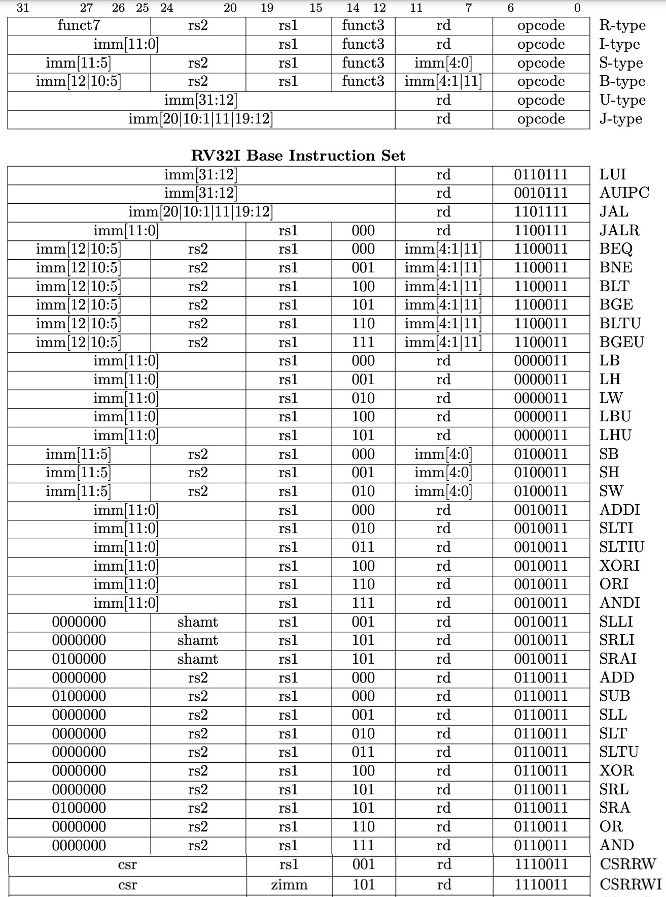

# EECS 151/251A ASIC Project Specification: Checkpoint 1
<p align="center">
Prof. Bora Nikolic
</p>
<p align="center">
TAs: Daniel Grubb, Nayiri Krzysztofowicz, Zhaokai Liu
</p>
<p align="center">
Department of Electrical Engineering and Computer Science
</p>
<p align="center">
College of Engineering, University of California, Berkeley
</p>

---

## ALU design and pipeline diagram
The ALU that we will implement in this lab is for a RISC-V instruction set architecture. Pay close attention to the design patterns and how the ALU is intended to function in the context of the RISC-V processor. In particular it is important to note the separation of the datapath and control used in this system which we will explore more here.

The specific instructions that your ALU must support are shown in the tables below. The branch condition should not be calculated in the ALU. Depending on your CPU implementation, your ALU may or may not need to do anything for branch, jump, load, and store instructions (i.e., it can just output 0).

---

### 1. Makeing a pipeline diagram


The first step in this project is to make a pipeline diagram of your processor, as described in lecture. You only need to make a diagram of the datapath (not the control). Each stage should be clearly separated with a vertical line, and flip-flops will form the boundary between stages. It is a good idea to name signals depend on what stage they are in (eg. s1_killf, s2_rd0). Also, it is a good idea to separately name the input/output (D/Q) of a flip flop (eg. s0_next_pc, s1_pc). Draw your diagram in a drawing program (Inkscape, Google Drawings, draw.io or any program you want), because you will need to keep it up-to-date as you build your processor. It helps to print out scratch copies while you are debugging your processor and to keep your drawings revision-controlled with git. Once you have finished your initial datapath design, you will implement the main building block in the datapath—the ALU.

---

### 2. ALU functional specification
Given specifications about what the ALU should do, you will create an ALU in Verilog and write a test harness to test the ALU.

The encoding of each instruction is shown in the table below. There is a detailed functional de- scription of each of the instructions in Section 2.4 of the [Instruction Set Manual](https://riscv.org/wp-content/uploads/2017/05/riscv-spec-v2.2.pdf). Pay close attention to the functional description of each instruction as there are some subtleties. Also, note that the `LUI` instruction is somewhat different from the MIPS version of `LUI` which some of you may be used to.

<p align="center">

</p>

---

### 3 Project Files
We have provided a skeleton directory structure to help you get started.

Inside, you should see a `src` folder, as well as a `tests` folder. The `src` folder contains all of
the verilog modules for this phase, and the `tests` folder contains some RISC-V test binaries for your processor.

---

### 4 Testing the Design
Before writing any of modules, you will first write the tests so that once you’ve written the modules you’ll be able to test them immediately. This is effectively Test-driven Development (TDD). Writing tests first is good practice- it forces you to write thorough tests, and ensures that tests will exist when you need to rapidly iterate through module design tweaks. Thorough understanding of the expected functionality is key to writing good tests (or RTL). You will be expected to write unit tests for any mod- ules that you design and implement and write integration tests. Unit tests will verify the functionality of individual modules against your specification. Integration tests verify that all the modules work as a system once you connect them together.

#### 4.1 Verilog Testbench
One way of testing Verilog code is with testbench Verilog files. The outline of a test bench file has been provided for you in ``ALUTestbench.v``. There are several key components to this file:
- `` `timescale 1ns / 1ps`` - This specifies, in order,the reference time unit and the precision. This example sets the unit delay in the simulation to 1ns (i.e. #1 = 1ns) and the precision to 1ps (i.e. the finest delay you can set is #0.001 = 1ps).
- The clock is generated by the code below. Since the ALU is only combinational logic, this is not necessary, but it will be a helpful reference once you have sequential elements.
    - The ``initial`` block sets the clock to 0 at the beginning of the simulation. You should be sure to only change your stimulus when the clock is falling, since the data is captured on the rising edge. Otherwise, it will not only be difficult to debug your design, but it will also cause hold time violations when you run gate level simulation.
    - You must use an always block without a sensitivity list (the @ part of an always statement) to cause the clock to run automatically.
    ```verilog
        parameter Halfcycle = 5; //half period is 5ns
        localparam Cycle = 2*Halfcycle;
        reg Clock;
        // Clock Signal generation:
        initial Clock = 0;
        always #(Halfcycle) Clock =  ̃Clock;
    ```
- ``task checkOutput``; - this task contains Verilog code that you would otherwise have to copy paste many times. Note that it is not the same thing as a function (as Verilog also has functions).
- ``{$random} & 31'h7FFFFFFF `` - $random generates a pseudorandom 32-bit integer. A bitwise AND will mask the result for smaller bit widths.

For these two modules, the inputs and outputs that you care about are ``opcode``, ``funct``, ``add_rshift_type``, ``A``, ``B`` and ``Out``. To test your design thoroughly, you should work through every possible `opcode`, `funct`, and ``add_rshift_type`` that you care about, and verify that the correct Out is generated from the A and B that you pass in.

The test bench generates random values for ``A`` and ``B`` and computes ``REFout = A + B``. It also contains calls to ``checkOutput`` for load and store instructions, for which the ALU should perform addition. It will be up to you to write tests for the remaining combinations of opcode, funct, and ``add_rshift_type`` to test your other instructions.

Remember to restrict ``A`` and ``B`` to reasonable values (e.g. masking them, or making sure that they are not zero) if necessary to guarantee that a function is sufficiently tested. Please also write tests where the inputs and the output are hard-coded. These should be corner cases that you want to be certain are stressed during testing.

---

#### 4.2 Test Vector Testbench
An alternative way of testing is to use a test vector, which is a series of bit arrays that map to the inputs and outputs of your module. The inputs can be all applied at once if you are testing a combinational logic block or applied over time for a sequential logic block (e.g. an FSM).

You will write a Verilog testbench that takes the parts of the bit array that correspond to the inputs of the module, feeds those to the module, and compares the output of the module with the output bits of the bit array. The bit vector should be formatted as follows:
```verilog
[106:100] = opcode
[99:97] = funct
[96] = add_rshift_type
[95:64] = A
[63:32] = B
[31:0] = REFout
```
Open up the skeleton provided to you in ``ALUTestVectorTestbench.v``. You need to complete the module by making use of ``$readmemb`` to read in the test vector file (named testvectors.input), writing some assign statements to assign the parts of the test vectors to registers, and writing a for loop to iterate over the test vectors.

The syntax for a for loop can be found in ``ALUTestbench.v``. ``$readmemb`` takes as its arguments a filename and a reg vector, e.g.:

```verilog
reg [5:0] bar [0:20];
$readmemb(\foo.input", bar);
```

#### 4.3 Writing Test Vectors
Additionally, you will also have to generate actual test vectors to use in your test bench. A test vector can either be generated in Verilog (like how we generated ``A``, ``B`` using the random number generator and iterated over the possible opcodes and functs), or using a scripting language like Python. Since we have already written a Verilog test bench for our ALU and decoder, we will tackle writing a few test vectors by hand, then use a script to generate test vectors more quickly.

Test vectors are of the format specified above, with the 7 opcode bits occupying the left-most bits. In the tests folder, create the file testvectors.input and add test vectors for the following instructions to the end (i.e. manually type the 107 zeros and ones required for each test vector): ``SLT``, ``SLTU``, ``SRA``, and ``SRL``.

In the same directory, we’ve also provided a test vector generator ``ALUTestGen.py`` written in Python, which is a popular language used for scripting. We used this generator to generate the test vectors provided to you. If you’re curious, you can read the next paragraph and poke around in the file. If not, feel free to skip ahead to the next section.

The script ``ALUTestGen.py`` is located in ``tests``. Run it so that it generates a test vector file in the tests folder. Keep in mind that this script makes a couple assumptions that aren’t necessary and may differ from your implementation:

- Jump, branch, load and store instructions will use the ALU to compute the target address. 

- For all shift instructions, `A` is shifted by `B`. In other words, `B` is the shift amount.

- For the `LUI` instruction, the value to load into the register is fed in through the `B` input.

You can either match these assumptions or modify the script to fit with your implementation. All the methods to generate test vectors are located in the two Python dictionaries ``opcodes`` and ``functs``. The lambda methods contained (separated by commas) are respectively: the function that the operation should perform, a function to restrict the ``A`` input to a particular range, and a function to restrict the ``B ``input to a particular range.

**If you modify the Python script**, run the generator to make new test vectors. This will overwrite the ``testvectors.input`` file, so if you want to save your handwritten test vectors, rename the file before running the script, then append them once the file has been generated.
```shell
python ALUTestGen.py
```
This will write the test vector into the file ``testvectors.input``. Use this file as the target test vector
file when loading the test vectors with ``$readmemb``.

---

### 5 Writing Verilog Modules
For this exercise, we’ve provided the module interfaces for you. They are logically divided into a control (``ALUdec.v``) and a datapath (``ALU.v``). The datapath contains the functional units while control contains the necessary logic to drive the datapath. You will be responsible for implementing these two modules. Descriptions of the inputs and outputs of the modules can be found in the first few lines of each file. The ALU should take an ``ALUop`` and its two inputs ``A`` and ``B``, and provide an output dependent on the ``ALUop``. The operations that it needs to support are outlined in the Functional Specification. Don’t worry about sign extensions–they should take place outside of the ALU. The ALU decoder uses the ``opcode``, ``funct``, and ``add_rshift_type`` to determine the ``ALUop`` that the ALU should execute. The ``funct`` input corresponds to the ``funct3`` field from the ISA encoding table. The ``add_rshift_type`` input is used to distinguish between ``ADD/SUB``, ``SRA/SRL``, and ``SRAI/SRLI``; you will notice that each of these pairs has the same ``opcode`` and ``funct3``, but differ in the ``funct7 `` field.

You will find the case statement useful, which has the following syntax:
```verilog
always@(*) begin
    case(foo)
        3'b000: // something happens here
        3'b001: // something else happens here
        3'b010, 3'b011: // you can have more than
                        // one case do the same thing
        default: // everything else
endcase end
```

To make your job easier, we have provided two Verilog header files: ``Opcode.vh`` and ``ALUop.vh``. They provide, respectively, macros for the opcodes and functs in the ISA and macros for the different ALU operations. You should feel free to change ``ALUop.vh`` to optimize the ``ALUop`` encoding, but if you change ``Opcode.vh``, you will break the test bench skeleton provided to you. You can use these macros by placing a backtick in front of the macro name, e.g.:

```verilog
case(opcode)
 OPC_STORE:
 ```
is the equivalent of:
```verilog
case(opcode)
7'b0100011:
```

---

### 6 Running the Simulation

Open the file ``sim-rtl.yml``, set the testbench’s name to be ALUTestbench. 

```yaml
tb_name: &TB_NAME "ALUTestbench"
```

By typing ```make sim-rtl``` you will run the ALU simulation.You may change the testbench’s name to ```ALUTestVectorTestbench``` to use the test vector testbench.

Once you have a working design, you should see the following output when you run either of the given testbenches:
```shell
# ALL TESTS PASSED! 
```

To clean the simulation directory from previous simulations’ files, type ``make clean``.


---

### 7 Viewing Waveforms

As in the previous labs, you should use DVE to view waveforms.
1. List of the modules involved in the test bench. You can select one of these to have its signals show up in the object window.
2. Object window - this lists all the wires and regs in your module. You can add signals to the waveform view by selecting them, right-clicking, and doing Add To Wave Selected Signals.
3. Waveform viewer - The signals that you add from the object window show up here. You can navigate the waves by searching for specific values, or going forward or backward one transition at a time.
As an example of how to use the waveform viewer, suppose you get the following output when you run

```shell
ALUTestbench:
# FAIL: Incorrect result for opcode 0110011, funct: 101:, add_rshift_type: 1
#       A: 0x92153524, B: 0xffffde81, DUTout: 0x490a9a92, REFout: 0xc90a9a92
```

The ``$display()`` statement actually already tells you everything you need to know to fix your bug, but you’ll find that this is not always the case. For example, if you have an FSM and you need to look at multiple time steps, the waveform viewer presents the data in a much neater format. If your design had more than one clock domain, it would also be nearly impossible to tell what was going on with only ``$display()`` statements.

Add all the signals from ``ALUTestbench`` to the waveform viewer and you see the following window: The two highlighted boxes contain the tools for navigation and zoom. You can hover over the icons to find out more about what each of them do. You can find the location (time) in the waveform viewer where the test bench failed by searching for the value of DUTout output by the ``$display()`` statement above (in this case, ``0x490a9a92``):

1. Selecting DUTout
2. ClickingEdit > Wave Signal Search > Search for Signal Value > ``0x490a9a92``

Now you can examine all the other signal values at this time. Compare the ```DUTout``` and ```REFout``` values at this time, and you should see that they are similar but not quite the same. From the ``opcode``, ``funct``, and ```add_rshift_type```, you know that this is supposed to be an ``SRA`` instruction, but it looks like your ALU performed a ``SRL`` instead. However, you wrote
```verilog
Out = A >>> B[4:0];
```
That looks like it should work, but it doesn’t! It turns out you need to tell Verilog to treat B as a signed
number for SRA to work as you wish. You change the line to say:
```verilog
Out = $signed(A) >>> B[4:0];
```
After making this change, you run the tests again and cross your fingers. Hopefully, you will see the line:
```shell
# ALL TESTS PASSED!
```
If not, you will need to debug your module until all test from the test vector file and the hard-coded test cases pass.

---

###  8 Checkpoint #1: Simple test program
*Checkoff due: Friday, November 5, 2021*


Congratulations! You’ve started the design of your datapath by drawing a pipeline diagram, and written and thoroughly tested a key component in your processor. You should now be well-versed in testing Verilog modules. Please answer the following questions to be checked off by a TA:
1. Show your pipeline diagram, and explain when writes and reads occur in the register file and memory relative to the pipeline stages.
2. Show your working ALU test bench files to your TA and explain your hard-coded cases. You should also be able to show that the tests for the test vectors generated by the Python script and your hard-coded test vectors both work.
3. In ALUTestbench, the inputs to the ALU were generated randomly. When would it be preferable to perform an exhaustive test rather than a random test?
4. What bugs, if any, did your test bench help you catch?
5. For one of your bugs, come up with a short assembly program that would have failed had you not caught the bug. In the event that you had no bugs and wrote perfect code the first time, come up with an assembly program to stress the SRA bug mentioned in the above section.

## Acknowledgement

This project is the result of the work of many EECS151/251 GSIs over the years including:
Written By:
- Nathan Narevsky (2014, 2017)
- Brian Zimmer (2014)
Modified By:
- John Wright (2015,2016)
- Ali Moin (2018)
- Arya Reais-Parsi (2019)
- Cem Yalcin (2019)
- Tan Nguyen (2020)
- Harrison Liew (2020)
- Sean Huang (2021)
- Daniel Grubb, Nayiri Krzysztofowicz, Zhaokai Liu (2021)