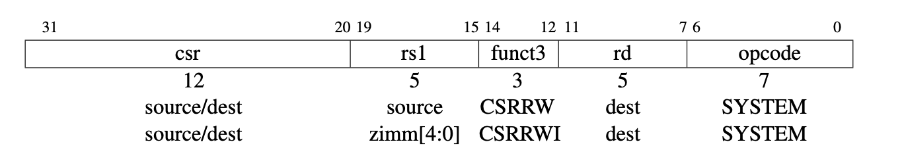

# EECS 151/251A ASIC Project Specification: Checkpoint 2
<p align="center">
Prof. Bora Nikolic
</p>
<p align="center">
TAs: Daniel Grubb, Nayiri Krzysztofowicz, Zhaokai Liu
</p>
<p align="center">
Department of Electrical Engineering and Computer Science
</p>
<p align="center">
College of Engineering, University of California, Berkeley
</p>

---
## Fully functioning core

### 1. Additional Instructions
In order to run the testbenches, there are a few new instructions that need to be added for help in
debugging/creating testbenches. Read through Chapter 9 in the RISC-V specification. A CSR (or
control status register) is some state that is stored independent of the register file and the memory.
While there are 2^12 possible CSR addresses, you will only use one of them (`tohost = 0x51E`). The
`tohost` register is monitored by the test harness, and simulation ends when a value is written to this
register. A value of 1 indicates success, a value greater than 1 gives clues as to the location of the failure.
There are 2 CSR related instructions that you will need to implement:
1. `csrw tohost,t2` (short for `csrrw x0,csr,rs1` where `csr = 0x51E`)
2. `csrwi tohost,1` (short for `csrrwi x0,csr,zimm` where `csr = 0x51E`)

`csrw` will write the value from register in rs1. `csrwi` will write the immediate (stored in rs1) to
the addressed csr. Note that you do not need to write to rd (writing to x0 does nothing).

<p align="center">

</p>

### 2. Details
Your job is to implement the core of the 3-stage RISC-V CPU.

### 3. File Structure
Implement the datapath and control logic for your RISC-V processor in the file `Riscv151.v`. Make
sure that the inputs and outputs remain the same, since this module connects to the memory system
for system-level testing. If you look at `riscv_test_harness.v` you can see a testbench that
is provided. Target this testbench in your `sim-rtl.yml` file by changing the `tb_name` key to
`rocketTestHarness`.

### 4. Running the Test
This testbench will load a program into the instruction memory, and will then run until the exit code
register has been set. There is also a timeout to make sure that the simulation does not run forever. This
will also tell you whether or not your testbench is passing the test. You should only be running this test
suite after you have eliminated some of the bugs using single instruction tests described below.

### 5. Running assembly tests
We have provided a suite of assembly tests to help you debug all of the instructions you need to estimate.
To run all of them:
```
make sim-rtl test_asm=all
```
This will generate .out files in the `asm_output/` directory, and summarize which tests passed and
failed. You can also run a single asm test with the following command:
```
make sim-rtl test_asm=simple.out
```
If you would like to generate waveforms for a single test:
```
make sim-rtl test_asm=simple.vpd
```
’simple’ may be replaced with any of the available tests defined in the `Makefile`.

You can read the assembly code of the programs by looking at the dump file. Comments in the code
will help you understand what is happening.
```
cd tests/asm/
vim addi.dump
```
Last, you can see the hex code that is loaded directly into the memory by looking at the hex file.
```
cd tests/asm/
vim addi.hex
```


### 6. Checkpoint 2 Deliverables
*Checkoff due: Nov 10 (Wednesday), Nov 12 (Friday), Nov 15 (Monday), 2021*

Congratulations! You’ve started the design of your datapath by implementing your pipeline diagram, and written and thoroughly tested a key component in your processor and should now be wellversed in testing Verilog modules. Please answer the following questions to be checked off by a TA.

1. Show that all of the assembly tests pass

2. Show your final pipeline diagram, updated to match the code.

3. Push your implementation and updated pipeline diagram to your repo.

---


## Acknowledgement

This project is the result of the work of many EECS151/251 GSIs over the years including:
Written By:
- Nathan Narevsky (2014, 2017)
- Brian Zimmer (2014)
Modified By:
- John Wright (2015,2016)
- Ali Moin (2018)
- Arya Reais-Parsi (2019)
- Cem Yalcin (2019)
- Tan Nguyen (2020)
- Harrison Liew (2020)
- Sean Huang (2021)
- Daniel Grubb, Nayiri Krzysztofowicz, Zhaokai Liu (2021)
